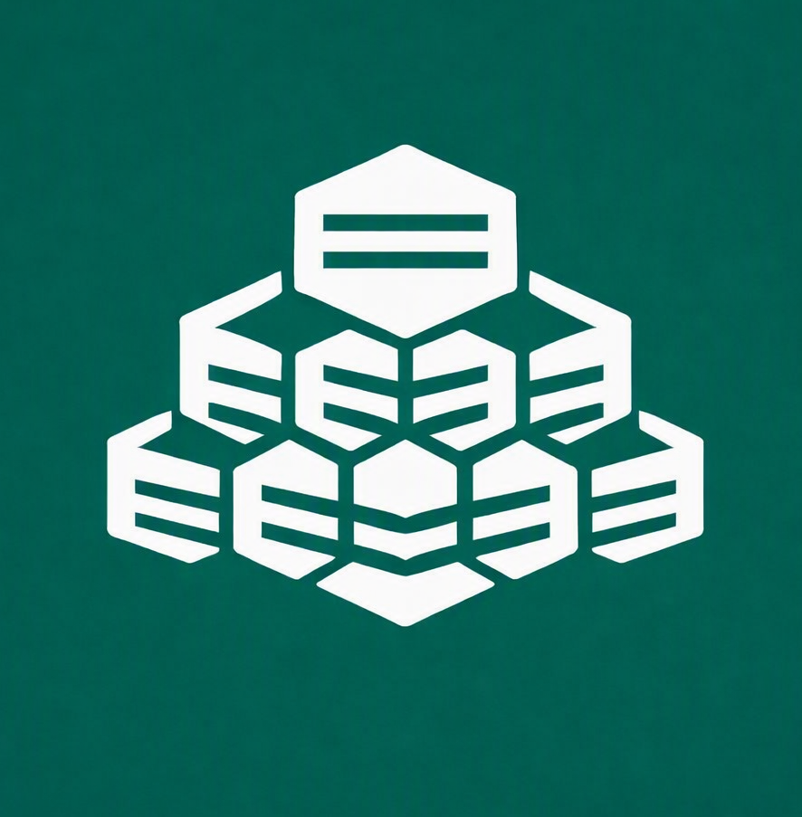
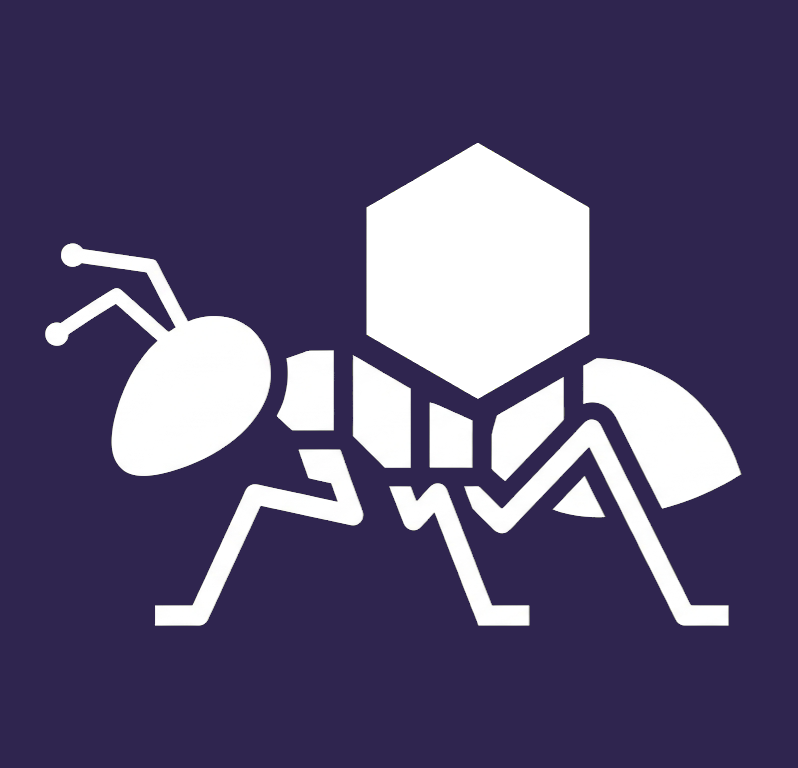

  

<h1 align="center">TERRA ECOSYSTEM</h1>

  <strong>Infraestructura Efímera, Serverless Nativa y Ecosistema de Computación a Coste Económico $0</strong>

  <a href="#-visión-y-filosofía">Visión</a> •
  <a href="#-el-motor-subyacente-github-engine">GitHub Engine</a> •
  <a href="#-las-aplicaciones-del-ecosistema">Apps del Ecosistema</a> •
  <a href="#-hiven-el-agente-cognitivo">Hiven AI</a> •
  <a href="#-hoja-de-ruta">Roadmap</a> •
  <a href="LICENSE">Licencia MIT</a>

---

## 🌍 Visión y Filosofía

**Terra** no es solo un conjunto de herramientas; es un paradigma de arquitectura y una filosofía de ingeniería de software. Nace como respuesta a los altos costes y la complejidad operativa de la nube moderna.

Su regla inquebrantable es: **Coste económico de infraestructura cero ($0) y mantenimiento nulo**, garantizando siempre una experiencia de usuario fluida, gratuita y libre de dependencias cautivas de terceros.

En Terra, la infraestructura no se alquila ni se mantiene encendida 24/7; **se invoca, se consume y se autodestruye en cuestión de segundos (El Laboratorio Fantasma).**

---

## ⚙️ El Motor Subyacente (GitHub Engine)

Terra transforma de forma legítima y creativa las primitivas gratuitas de la plataforma de GitHub en un motor de computación en la nube:

* **Computación (Compute):** Sustituida por **GitHub Actions**. Ejecuta lógica de negocio, contenedores efímeros y agentes de IA que mueren tras completar su tarea.
* **Almacenamiento y Estado (Storage):** Sustituida por la **Git Database API** y **GitHub Releases**. Los datos y estados se inyectan como JSONs o binarios inmutables sin clonar repositorios completos.
* **Colas y Tareas (Message Brokers):** Sustituidas por **GitHub Issues** y **`repository_dispatch`** para orquestación asíncrona de eventos.
* **Red de Distribución (CDN / Edge):** Sustituida por **GitHub Pages** para servir interfaces, dashboards y escudos perimetrales a escala global.

---

## 🐝 Hiven: El Agente Cognitivo Autónomo

  

  <strong>Hiven</strong> es la "Mente Enjambre" y el primer titán activo del ecosistema Terra.

Es un agente de ingeniería de software autónomo multi-agente (*Swarm*) de código abierto que actúa como un desarrollador Senior 24/7. Lee requerimientos en lenguaje natural, diseña la arquitectura, escribe código, ejecuta pruebas en sandboxes aislados y realiza despliegues/PRs autónomas sin requerir un servidor dedicado.

👉 **Explora el repositorio oficial de Hiven:** [Hiven Public Repository](https://github.com/amglogicalis/hiven-repo-public)

---

## 🗄️ Rolla: Motor de Almacenamiento de Objetos

  

  <strong>Rolla</strong> es el almacén de objetos inmutable e ilimitado a coste $0 del ecosistema.

Permite almacenar e intercambiar archivos de cualquier tamaño mediante **Rolla-Balls** (*Balls*) sobre GitHub Releases, con soporte transparente para fragmentación (*chunking*) de archivos >2GB y distribución perimetral global. Incluye SDK para Node.js/TypeScript, CLI interactiva y consola web nativa.

👉 **Explora el repositorio oficial de Rolla:** [Rolla Public Repository](https://github.com/amglogicalis/rolla-repo-public)

---

## 🌐 Webbl: Motor de Hosting & CDN Global

  

  <strong>Webbl</strong> es la infraestructura de alojamiento estático, SPAs y Serverless Morphs del ecosistema Terra a coste $0.

Permite desplegar proyectos web (Vite, React, Astro, Next.js estático) en **Cocoons** sobre GitHub Pages, ejecutar funciones Serverless (**Async, Build y Hatch Morphs**) y utilizar inteligencia de compilación (**Chrysalis**). Incluye consola web interactiva 24/7 y CLI.

👉 **Explora el repositorio oficial de Webbl:** [Webbl Public Repository](https://github.com/amglogicalis/webbl-repo-public)

---

## 🏛️ Combase: Motor de Base de Datos & Time-Travel

  

  <strong>Combase</strong> es el motor de base de datos relacional y documental transaccional del ecosistema Terra a coste $0.

Permite ejecutar consultas ANSI SQL y sobre JSON en repositorios protegidos `.combase-storage`, ofrece **Zero-Copy Database Branching**, **Time-Travel Querying** (consultas a cualquier estado del pasado) y replicación multicloud hacia **PostgreSQL**, **Supabase**, **AWS DynamoDB** y **SQLite**. Incluye entorno de desarrollo visual **COMBASE SQL Studio** y CLI.

👉 **Explora el repositorio oficial de Combase:** [Combase Public Repository](https://github.com/amglogicalis/combase-repo-public)

---

## 🔐 Lumina: Identidad, Políticas IAM & Sanctuaries Multi-Entorno

  

  <strong>Lumina</strong> es la infraestructura de identidad (IdP), Sanctuaries multi-entorno, políticas granulares estilo AWS IAM y broker multicloud del ecosistema Terra a coste $0.

Permite aislar completamente entornos mediante **Sanctuaries** (`production`, `staging`), gestionar identidades multi-rol (**Photuris Vault**), evaluar políticas `Allow`/`Deny` con wildcards (`*`) sobre recursos `arn:terra:...` (**Pyralis IAM**), firmar y verificar JWTs y publicar claves públicas JWKS (**Luciole Engine**), emitir Magic Links sin contraseña (**LanternLinks**), gestionar accesos de emergencia super-admin de 15 min (**Glowworm Break-Glass**) y exportar a Auth0, Supabase, AWS IAM y Firebase (**Coleoptera Bridge**). Incluye consola web visual **LUMINA Studio** (desplegada online 24/7) y CLI.

👉 **Explora el repositorio oficial de Lumina:** [Lumina Public Repository](https://github.com/amglogicalis/lumina-repo-public)

---

## 🎭 Ballom: Motor de Enmascaramiento DNS, API Gateway & Routing

  

  <strong>Ballom</strong> es la infraestructura de enmascaramiento de URLs (Feromask), API Gateway Serverless (ChitinGate), acortador de enlaces con prefijos flexibles (Larvae), enrutador inteligente (PheroPaths) y gestión de API Keys criptográficas con ámbitos de permisos personalizados (ScentKeys) del ecosistema Terra a coste $0.

Permite enmascarar cualquier aplicación web bajo dominios estéticos comunitarios gratuitos (`.is-a.dev`, `.is-an.app`, `.1337.cx`, `.js.org`, `.sub.id`, `.eu.org`, `.github.io`) o dominios propios, implementar escudos de alta disponibilidad (**BackSheds HA Failover**), publicar endpoints de datos JSON o disparadores de **GitHub Actions** con esquemas de entrada personalizados, enrutar peticiones mediante expresiones regulares y webhooks, y gestionar claves API de forma 100% segura con purga masiva de claves inactivas. Incluye consola web interactiva 24/7 (desplegada online en vivo), SDK para Node.js/TypeScript y CLI global.

👉 **Explora el repositorio oficial de Ballom:** [Ballom Public Repository](https://github.com/amglogicalis/ballom-repo-public)

---

## 🕷️ Termes: Digestor DOM, Anti-Bot Stealth & Sintetizador de APIs Inversas

  

  <strong>Termes</strong> es la infraestructura de digestión web autónoma, automatización headless, camuflaje sigiloso Mud Tunnel y sintetizador de APIs Inversas a coste $0 del ecosistema Terra.

Permite transformar cualquier sitio web del mundo sin API pública, tienda e-commerce o portal legacy en una **API Sintética REST instantánea a 0ms en CDN** y disparador de **Webhooks Invertidos (Site-to-Webhook)** con sigilo Anti-Bot y trazabilidad 100% segura. Incluye consola web interactiva 24/7 (desplegada online en vivo), paquete CLI global (`npm install -g terra-termes`) y SDK TypeScript nativo.

👉 **Explora el repositorio oficial de Termes:** [Termes Public Repository](https://github.com/amglogicalis/termes-repo-public)

---

## 🛡️ Sinchlor: Camuflaje de Credenciales, DNS de Secretos & Secretos Efímeros

  

  <strong>Sinchlor</strong> es la infraestructura de camuflaje de credenciales, enmascaramiento de secretos, DNS de credenciales y secretos efímeros a coste $0 del ecosistema Terra.

Permite convertir tokens crudos y de alto riesgo (`ghp_...`, `sk-proj-...`, `AKIA...`) en **Pétalos Semánticos** legibles (`sinchlor:alias` y `[sinchlor:alias]`) resueltos **exclusivamente en memoria RAM** durante la ejecución de los procesos. Incorpora **Sinchlor Parades** (equipos y políticas RBAC), **PetalTraps** (honeytokens señuelo con alertas multicanal a Discord/Telegram/GitHub) y **Néctar Efímero** (credenciales temporales con TTL y autodestrucción tras 1-solo uso). Incluye consola web interactiva 24/7 (desplegada online en vivo), paquete CLI global (`npm install -g terra-sinchlor`) y SDK TypeScript nativo.

👉 **Explora el repositorio oficial de Sinchlor:** [Sinchlor Public Repository](https://github.com/amglogicalis/sinchlor-repo-public)

---

## 🐜 Formica: Event Mesh, K/V Cache, Telemetría, WAF Guard & Purga Universal

  

  <strong>Formica</strong> es la plataforma de infraestructura distribuida del ecosistema Terra a coste $0: bus de eventos Pub/Sub (<strong>Pheromones</strong>), caché K/V distribuido (<strong>Chambers</strong>), telemetría estructurada (<strong>Foragers</strong>), WAF Gateway prioritario (<strong>Soldiers</strong>), motor modular de purga universal (<strong>Legionarys</strong>) y hub central de conectividad de providers (<strong>Providers Hub</strong>). Procesamiento asíncrono en la nube mediante el servidor auto-hospedado en GitHub Actions (<strong>Anthill</strong>).

Permite conectar microservicios, apps Terra y servicios externos (AWS Lambda, Azure Functions, Python, Discord) mediante eventos asíncronos por tópicos, almacenar caché K/V con TTL en Git, registrar telemetría centralizada con Correlation IDs y source-grouping, proteger endpoints con reglas WAF de prioridad configurable (bloqueo por IP, cabecera, path o rate-limit), y ejecutar **purgados efímeros simulados (*Dry-Run*) y reales** de recursos caducados en **Sinchlor**, **Rolla**, **Ballom**, **Lumina**, **Termes**, **Combase** o adaptadores custom. El servidor **Anthill** procesa eventos en background (GitHub Actions) con cold-start ~20-30s y auto-sleep tras 10 min de inactividad — coste cero en repos públicos. Incluye consola web interactiva 24/7 **Formica Queen Studio** (desplegada online en vivo), paquete CLI global v2.0 (`npm install -g terra-formica`) y SDK TypeScript nativo con 100% de paridad funcional.

👉 **Explora el repositorio oficial de Formica:** [Formica Public Repository](https://github.com/amglogicalis/formica-repo-public)

---

## 🏛️ Las Aplicaciones del Ecosistema Terra

El ecosistema está compuesto por **21 aplicaciones modulares** («Titanes») que pueden operar de forma aislada o en perfecta sinergia:

| App | Dominio | Estado | Descripción |
| :--- | :--- | :---: | :--- |
| 🐝 **Hiven** | *AI & Logic* | 🟢 **Completado** | Agente cognitivo autónomo y sintetizador de lógica multi-enjambre. |
| 🗄️ **Rolla** | *Object Storage* | 🟢 **Completado** | Motor de almacenamiento de objetos inmutable e ilimitado sobre Rolla-Balls. |
| 🌐 **Webbl** | *Hosting & CDN* | 🟢 **Completado** | Alojamiento frontend estático instantáneo con distribución perimetral (Cocoons, Morphs & Chrysalis). |
| 🏛️ **Combase** | *Base de Datos Efímera* | 🟢 **Completado** | Motor relacional/documental transaccional, Zero-Copy Branching y Time-Travel a coste $0. |
| 🔐 **Lumina** | *IAM & Identity* | 🟢 **Completado** | Proveedor de identidad, Sanctuaries multi-entorno, políticas granulares AWS IAM, JWT/JWKS & Magic Links. |
| 🎭 **Ballom** | *DNS & Routing* | 🟢 **Completado** | Capa de enmascaramiento DNS, Feromask HA shield, API Gateway $0, Larvae short links y ScentKeys IAM. |
| 🕷️ **Termes** | *Scraping & APIs* | 🟢 **Completado** | Digestor de datos no estructurados, headless browser y generador de APIs sintéticas. |
| 🛡️ **Sinchlor** | *Gestión de Secretos* | 🟢 **Completado** | Camuflaje de credenciales, DNS de secretos y gestión de secretos efímeros. |
| 🐜 **Formica** | *Event Mesh & Purga* | 🟢 **Completado** | Bus Pub/Sub (Pheromones), K/V Chambers, telemetría Foragers, WAF Soldiers, purga Legionarys, Anthill & CLI v2. |
| ⏰ **Syncada** | *Orquestación & Crons* | 🟡 **Próxima — En Desarrollo** | Reloj maestro asíncrono, colas de mensajes y dispatcher de eventos cruzados. |
| 🦗 **Grillout** | *Colas & Mensajería* | ⚪ *Planificado* | Motor de colas asíncronas, mensajería y notificaciones efímeras. |
| ⚡ **Pheri** | *Real-Time Streaming* | ⚪ *Planificado* | Tuberías de eventos y streaming de alta frecuencia de coste cero. |
| 🐝 **MockHive** | *Compute & Serverless* | ⚪ *Planificado* | Entornos efímeros (Hives), funciones serverless (PollenPods) y grafos (Waggles). |
| 🦟 **Maskito** | *Testing & Data* | ⚪ *Planificado* | Motor de pruebas de estrés masivo y siembra sintética de datos. |
| 🦎 **Lepisma** | *Salud de Dependencias* | ⚪ *Planificado* | Motor de salud estructural, mapeo de dependencias y anti-decadencia. |
| 🛡️ **Waisp** | *Red Teaming* | ⚪ *Planificado* | Orquestador de seguridad ofensiva y pentesting dinámico (DAST) automatizado. |
| 🦗 **Chiton** | *Gobernanza & FinOps* | ⚪ *Planificado* | Blindaje preventivo de PRs, escaneo de secretos y auditoría multicloud. |
| 🦋 **Decrefly** | *Control Financiero* | ⚪ *Planificado* | Motor de equilibrio activo, techo financiero y arquitectura de suma cero. |
| 📊 **Libella** | *Observabilidad & Telemetría* | ⚪ *Planificado* | Panóptico universal de telemetría, métricas y control de costes efímero. |
| 🧠 **Mantx** | *AutoML & LLMOps* | ⚪ *Planificado* | Arena de batalla de modelos ML/SLM e inferencia predictiva efímera. |
| 🎛️ **Terra Console & Hub** | *Orquestación & Comunidad* | ⚪ *Planificado* | Centro de mando unificado y ecosistema público (Forest, Library, Colony). |

---

## 🚀 Hoja de Ruta de Desarrollo

El criterio de ordenación es sencillo: **no se implementa una herramienta hasta que exista algo que justifique su existencia**. Una herramienta de observabilidad (`Libella`) no tiene sentido antes de que haya apps que observar. Un motor de purgado (`Formica Legionarys`) no tiene sentido antes de que exista infraestructura que purgar.

1. **🧱 Fase 1 — Fundamentos:** `Webbl` ✅ ➡️ `Combase` ✅ *(almacenamiento, hosting y base de datos)*
2. **🔒 Fase 2 — Identidad & Seguridad:** `Lumina` ✅ ➡️ `Ballom` ✅ *(auth, identidad, enrutamiento y proxy perimetral)*
3. **🛡️ Fase 3 — Extracción, Datos & Secretos:** `Termes` ✅ ➡️ `Sinchlor` ✅ *(scraping inteligente, sintetizador de APIs y camuflaje de secretos)*
4. **🔗 Fase 4 — Comunicación & Orquestación:** `Formica` ✅ ➡️ `Syncada` 🚧 *(en desarrollo — próxima)* ➡️ `Grillout` ➡️ `Pheri` *(sistema nervioso del enjambre)*
5. **🐝 Fase 5 — Compute:** `MockHive` *(cómputo efímero bajo demanda)*
6. **🧪 Fase 6 — Testing & Calidad:** `Maskito` ➡️ `Lepisma` ➡️ `Waisp` *(validación de lo existente)*
7. **🧹 Fase 7 — Gobernanza & Control:** `Chiton` ➡️ `Decrefly` ➡️ `Libella` *(solo útil cuando hay infra activa — Formica Legionarys ya disponible ✅)*
8. **🧠 Fase 8 — Inteligencia Artificial:** `Mantx` *(capa avanzada sobre infra consolidada)*
9. **🎛️ Fase 9 — Plataforma:** `Terra Console & Hub` *(centro de mando y comunidad)*

---

  Desarrollado bajo la filosofía Terra • Infraestructura Efímera de Coste $0

