# 🌍 TERRA ECOSYSTEM — AGENT HANDOVER & MASTER DIRECTIVE
> **Para**: Antigravity AI Agent (Cualquier máquina o nueva sesión)  
> **Propósito**: Informe y reporte técnico maestro sobre el Ecosistema Terra, su filosofía de arquitectura, estado actual de todas sus aplicaciones, orden estratégico de implementación y especificación detallada de cada módulo para continuar el desarrollo sin perdida de contexto.

---

## 🏛️ 1. Visión General, Filosofía y Fundamentos de Terra

**Terra** es un ecosistema completo de infraestructura Cloud, DevOps, Almacenamiento, Seguridad e Inteligencia Artificial diseñado bajo una premisa radical: **Construir una Nube Serverless e Inmutable a Coste $0 para el usuario final**.

### 💡 Filosofía Central:
1. **GitHub Engine como Infraestructura**: Terra aprovecha las primitivas de GitHub (Actions, Releases, Pages, Issues, Git API, Dispatches) para sustituir proveedores cloud tradicionales (AWS, GCP, Vercel, Supabase, Snowflake) sin generar costes de infraestructura recurrentes.
2. **Puente de Control Ligero a Coste $0**: Cuando la latencia de arranque o la asincronía de GitHub Actions dificulta la experiencia en tiempo real (ej. WebSockets, autenticación JWT o almacenamiento en caché ultrarrápido), Terra utiliza puentes de control livianos de nivel gratuito (Serverless Vercel Free Tier o Cloudflare Workers), garantizando siempre que el usuario final mantenga **independencia total y $0 en facturas**.
3. **Persistencia Basada en Git**: El estado del ecosistema no depende de bases de datos relacionales costosas. Se estructura mediante JSONs versionados en repositorios Git y objetos masivos encapsulados en Releases y Assets.
4. **Diseño Premium y DX Excepcional**: Todas las herramientas de Terra cuentan con interfaces web modernas (glassmorphism, modo oscuro, paletas tailoreadas), consolas silenciosas en segundo plano para sistemas de escritorio (PowerShell / VBScript), y herramientas CLI eficientes.

---

## 📊 2. Estado Global de las Aplicaciones del Ecosistema

Actualmente el ecosistema Terra cuenta con **9 Aplicaciones Creadas, Verificadas y 100% Funcionales**, mientras que **12 Titanes/Aplicaciones** están conceptualizadas con su especificación técnica lista para su implementación por fases (haciendo un total de **21 Titanes**).

### 🟢 Aplicaciones Creadas, Verificadas y Publicadas en NPM (10):
1. **🐝 HIVEN** (`c:\mis-proyectos\Terra\hiven`): Agente cognitivo autónomo multi-agente para ingeniería de software.
2. **🗄️ ROLLA** (`c:\mis-proyectos\Terra\rolla`): Motor de almacenamiento de objetos inmutable (estilo S3). Publicado en NPM como `terra-rolla@1.2.2`.
3. **🌐 WEBBL** (`c:\mis-proyectos\Terra\webbl`): Motor de hosting frontend & CDN global sobre GitHub Pages (Cocoons, Morphs & Chrysalis). Publicado en NPM como `terra-webbl@1.1.0`.
4. **🏛️ COMBASE** (`c:\mis-proyectos\Terra\combase`): Motor de base de datos relacional y documental transaccional, serverless y time-travel a coste $0. Publicado en NPM como `terra-combase@1.0.0`.
5. **🔐 LUMINA** (`c:\mis-proyectos\Terra\lumina`): Proveedor de Identidad (IdP), Sanctuaries multi-entorno, Políticas Granulares AWS IAM, JWT/JWKS, Magic Links & Broker Multicloud. Publicado en NPM como `terra-lumina@1.1.0`. Repo público: [amglogicalis/lumina-repo-public](https://github.com/amglogicalis/lumina-repo-public).
6. **🎭 BALLOM** (`c:\mis-proyectos\Terra\ballom`): Motor de Enmascaramiento DNS, Feromask HA shield, API Gateway $0, Larvae short links y ScentKeys IAM. Publicado en NPM como `terra-ballom@1.0.0`. Repo público: [amglogicalis/ballom-repo-public](https://github.com/amglogicalis/ballom-repo-public). Consola Web: [amglogicalis.github.io/ballom-repo-public/](https://amglogicalis.github.io/ballom-repo-public/).
7. **🕷️ TERMES** (`c:\mis-proyectos\Terra\termes`): Digestor DOM, Anti-Bot Stealth & Sintetizador de APIs Inversas. Publicado en NPM como `terra-termes@1.1.1`. Repo público: [amglogicalis/termes-repo-public](https://github.com/amglogicalis/termes-repo-public). Consola Web: [amglogicalis.github.io/termes-repo-public/](https://amglogicalis.github.io/termes-repo-public/).
8. **🛡️ SINCHLOR** (`c:\mis-proyectos\Terra\sinchlor`): Motor de Camuflaje de Credenciales, DNS de Secretos & Secretos Efímeros. Publicado en NPM como `terra-sinchlor@1.0.0`. Repo público: [amglogicalis/sinchlor-repo-public](https://github.com/amglogicalis/sinchlor-repo-public). Consola Web: [amglogicalis.github.io/sinchlor-repo-public/](https://amglogicalis.github.io/sinchlor-repo-public/).
9. **🐜 FORMICA** (`c:\mis-proyectos\Terra\formica`): The Formic Mesh — Event Mesh & Bus Pub/Sub (Pheromones), K/V Store distribuido (Chambers), Telemetría (Foragers), WAF Gateway prioritario (Soldiers), Motor de Purga Universal (Legionarys), Hub de Providers & Anthill (procesador asíncrono en GitHub Actions). Publicado como `terra-formica@2.0.0`. Repo público: [amglogicalis/Formica](https://github.com/amglogicalis/Formica). Consola Web Queen Studio: [amglogicalis.github.io/Formica/](https://amglogicalis.github.io/Formica/).
10. **🛡️ WAISP** (`c:\mis-proyectos\Terra\waisp`): Pentesting Automatizado, DAST, Red Teaming, Proof-of-Exploit (PoE) Dual-Phase Engine, NestHiveSandbox, AutoPotter Pipeline & WaispColony Mesh P2P. Publicado en NPM como `terra-waisp@1.3.0`. Repo público: [amglogicalis/waisp-repo-public](https://github.com/amglogicalis/waisp-repo-public). Consola Web: [amglogicalis.github.io/waisp-repo-public/](https://amglogicalis.github.io/waisp-repo-public/).

### 🟡 Próxima Aplicación a Construir (Fase 4: Orquestación & Cron Maestro):
👉 **⏰ SYNCADA** (`c:\mis-proyectos\Terra\syncada`): Orquestador de Tareas Programadas & Colas (Cron Maestro) — **objetivo: llegar a esta fase con Formica y Waisp completados ✅**.

### 📋 Resto de Aplicaciones Pendientes:
1. **⏰ SYNCADA**: Orquestador de Tareas Programadas & Colas (Cron Maestro) — **PRÓXIMA**.
2. **🦗 GRILLOUT**: Motor de Colas Asíncronas, Mensajería & Notificaciones Efímeras.
4. **⚡ PHERI**: Event Streaming en Tiempo Real de Alta Frecuencia.
5. **🐝 MOCKHIVE / MOCKHIVEN**: Infraestructura Efímera (PollenPods & Waggles).
11. **🦟 MASKITO**: Motor de Stress Testing & Generación Sintética de Datos.
12. **🦎 LEPISMA**: Motor de Salud Estructural, Mapeo de Dependencias & Anti-Decadencia.
13. **🛡️ WAISP**: Pentesting Automatizado & Red Teaming (DAST).
14. **🦗 CHITON**: Gobernanza, Detección de Secretos & FinOps Multicloud.
15. **🦋 DECREFLY**: Motor de Equilibrio Activo, Techo Financiero & Arquitectura de Suma Cero.
16. **📊 LIBELLA**: Panel de Observabilidad, Telemetría y FinOps.
17. **🧠 MANTX / MANTIS**: Arena AutoML, Inferencia Efímera & LLMOps.
18. **🎛️ TERRA CONSOLE & HUB**: Centro de Mando Interno & Ecosistema Público.

---

## 🗺️ 3. Orden Estratégico de Implementación (Hoja de Ruta por Fases)

El desarrollo del ecosistema Terra debe realizarse por **capas funcionales reutilizables**, donde cada app creada sirve como bloque fundamental para las siguientes. El criterio de ordenación es simple: **no se implementa una herramienta hasta que exista algo que justifique su existencia**. Una herramienta de observabilidad (Libella) no tiene sentido antes de que haya apps que observar. El purgado de recursos (Formica Legionarys) no tiene sentido antes de que exista infraestructura que purgar. Un gestor de costes (Decrefly) no tiene sentido antes de que haya algo que cueste dinero.

```mermaid
flowchart TD
    Fase1["🧱 Fase 1: Fundamentos de Infraestructura\n(El suelo sobre el que se construye todo)"]
    Fase1 --> ROLLA["🗄️ ROLLA ✅\nAlmacenamiento de objetos. Todo lo demás guarda datos aquí."]
    Fase1 --> WEBBL["🌐 WEBBL\nHosting & CDN. Expone los frontends de todos los titanes."]
    Fase1 --> COMBASE["🏛️ COMBASE\nBase de datos estructurada. Persistencia para todos los servicios."]

    Fase2["🔒 Fase 2: Identidad y Seguridad Primitiva\n(Sin identidad no hay autorización en nada)"]
    Fase2 --> LUMINA["🔐 LUMINA\nIdP & Magic Links. Auth para todas las consolas web."]
    Fase2 --> SYNCHLOR["🛡️ SYNCHLOR\nGestión de Secretos. Todas las apps necesitan credenciales seguras."]

    Fase3["🔗 Fase 3: Comunicación y Orquestación\n(El sistema nervioso del enjambre)"]
    Fase3 --> FORMICA["🐜 FORMICA ✅\nEvent Mesh, K/V Chambers, WAF, Purga Legionarys & Anthill."]
    Fase3 --> SYNCADA["⏰ SYNCADA 🚧\nCron maestro. Disparador temporal para todos los titanes. PRÓXIMA."]
    Fase3 --> GRILLOUT["🦗 GRILLOUT\nColas asíncronas. Notificaciones y mensajería efímera."]
    Fase3 --> PHERI["⚡ PHERI\nStreaming en tiempo real. Feeds de alta frecuencia."]

    Fase4["🌐 Fase 4: Red y Despliegue\n(Ahora que hay apps, necesitan rutas y nombres)"]
    Fase4 --> BALLOM["🎭 BALLOM\nEnmascaramiento DNS. Alias bonitos para URLs feas."]
    Fase4 --> MOCKHIVE["🐝 MOCKHIVE\nCómputo efímero serverless. Ejecutar código bajo demanda."]

    Fase5["🧪 Fase 5: Testing, Calidad y Scraping\n(Ahora que existe la infraestructura, se valida)"]
    Fase5 --> MASKITO["🦟 MASKITO\nStress Testing & Data Seeding. Pruebas de carga."]
    Fase5 --> TERMES["🕷️ TERMES\nWeb Scraping & APIs Sintéticas. Fuentes de datos externas."]
    Fase5 --> LEPISMA["🦎 LEPISMA\nSalud de dependencias. Anti-decadencia del código."]
    Fase5 --> WAISP["🛡️ WAISP\nPentesting & Red Teaming. Auditoría de seguridad ofensiva."]

    Fase6["🧹 Fase 6: Gobierno, Higiene y Control Financiero\n(Solo útil cuando ya existe infraestructura activa que limpiar y medir)"]
    Fase6 --> CHITON["🦗 CHITON\nGobernanza & FinOps Multicloud. Auditoría preventiva."]
    Fase6 --> FORMICA_LEG["🐜 FORMICA (LEGIONARYS)\nPurgado Universal. Limpieza de recursos huérfanos del enjambre."]
    Fase6 --> DECREFLY["🦋 DECREFLY\nTecho Financiero. Control activo de costes y suma cero."]
    Fase6 --> LIBELLA["📊 LIBELLA\nObservabilidad & Telemetría. Monitoriza lo que ya existe."]

    Fase7["🧠 Fase 7: Inteligencia Artificial\n(Capa avanzada sobre infraestructura consolidada)"]
    Fase7 --> MANTX["🧠 MANTX\nAutoML & Inferencia Efímera. Modelos de IA efímeros."]

    Fase8["🎛️ Fase 8: Capa de Orquestación y Comunidad\n(La consola y el hub solo tienen sentido cuando hay titanes que gestionar y compartir)"]
    Fase8 --> TERRA_CONSOLE["🎛️ TERRA CONSOLE & HUB\nCentro de mando + Ecosistema público (Forest, Library, Colony)."]
```

### 📐 Razonamiento del Orden

| Fase | Criterio | Titanes |
|:---|:---|:---|
| **1 - Fundamentos** | Sin almacenamiento, hosting y base de datos no existe nada más | WEBBL ✅, COMBASE ✅ |
| **2 - Identidad** | Sin autenticación y gestión de secretos, nada puede ser seguro | LUMINA ✅, SINCHLOR ✅ |
| **3 - Comunicación** | Una vez hay apps y auth, necesitan comunicarse entre sí | FORMICA ✅, SYNCADA 🚧 *(próxima)*, GRILLOUT, PHERI |
| **4 - Red y Compute** | Una vez hay servicios, necesitan rutas y cómputo bajo demanda | BALLOM ✅, MOCKHIVE |
| **5 - Testing** | Solo se puede testear lo que ya existe | MASKITO, TERMES ✅, LEPISMA, WAISP |
| **6 - Gobierno** | Solo se puede observar, limpiar y controlar lo que ya se ha desplegado | CHITON, DECREFLY, **LIBELLA** *(Formica Legionarys ya cubre purga básica ✅)* |
| **7 - IA** | Capa avanzada que requiere toda la infraestructura previa | MANTX |
| **8 - Plataforma** | La consola y el hub solo tienen sentido cuando hay titanes que gestionar | TERRA CONSOLE & HUB |

---

## 📘 4. Especificación Técnica Detallada de cada Aplicación

### 1. 🐝 HIVEN — Agente Cognitivo Autónomo
- **Estado**: 🟢 **Creada & Operativa**
- **Ubicación**: `c:\mis-proyectos\Terra\hiven`
- **¿Qué hace?**: Asistente autónomo de ingeniería de software multi-agente que resuelve Issues de GitHub creando Pull Requests con código verificado.
- **¿Cómo funciona?**: Emplea una topología Master-Worker (`hiven-komb-queen` en Vercel/Node + runners efímeros en GitHub Actions). Implementa RAG offline (TF-IDF), aprendizaje federado en Redis, guardas de eliminación de código y sandbox de ejecución previa a PR.
- **Para qué sirve**: Automatiza la resolución de tareas complejas de desarrollo sin intervención humana constante.

---

### 2. 🗄️ ROLLA — Motor de Almacenamiento de Objetos (S3-like)
- **Estado**: 🟢 **Creada & Operativa**
- **Ubicación**: `c:\mis-proyectos\Terra\rolla`
- **¿Qué hace?**: Sistema de almacenamiento inmutable de archivos y objetos sin límite de transferencia.
- **¿Cómo funciona?**: Mapea *Rolla-Balls* (buckets) a Releases de GitHub con tags `rolla-bkt-<nombre>` y *Objetos* a Assets. Mantiene un metadato `_manifest.json` y fragmenta automáticamente archivos de más de 2 GB. Utiliza lecturas instantáneas vía `/git/refs/tags`. Incluye SDK `@terra/rolla`, CLI `npx rolla` y Consola Web Estática 24/7 en GitHub Pages.
- **Para qué sirve**: Persistencia de binarios, modelos de IA, copias de seguridad y recursos estáticos para el resto de apps de Terra.

---

### 3. 🌐 WEBBL — Hosting Frontend & CDN Global
- **Estado**: 🟢 **Creada & Operativa**
- **Ubicación**: `c:\mis-proyectos\Terra\webbl`
- **¿Qué hace?**: Motor de despliegue automatizado de sitios web estáticos, SPAs y Serverless Morphs a coste $0 sobre GitHub Pages.
- **¿Cómo funciona?**: Integra 3 pilares principales: **Cocoons** (alojamiento de sitios y SPAs con rollback instantáneo), **Morphs** (funciones serverless async, build-time y live Hatch) y **Chrysalis** (inteligencia de compilación con autodetección de 14+ frameworks). Incluye SDK `@terra/webbl`, CLI `npx webbl` y Consola Web Estática.
- **Para qué sirve**: Alojar e interconectar las interfaces de todos los Titanes de Terra y cualquier sitio del usuario sin costes de infraestructura.

---

### 4. 📊 LIBELLA — Telemetría, Observabilidad & FinOps
- **Estado**: 🟡 **Pendiente**
- **Ubicación futura**: `c:\mis-proyectos\Terra\libella`
- **¿Qué hace?**: Panel unificado de observabilidad, trazabilidad de logs y control de consumo de minutos/recursos de GitHub Actions.
- **¿Cómo funciona?**: Un webhook ligero recibe métricas de ejecución, un workflow efímero persiste los logs estructurados en JSON dentro del repo y un dashboard estático procesa y grafica los resultados en tiempo real.
- **Para qué sirve**: Monitorear la salud del ecosistema Terra, diagnosticar errores y asegurar consumo $0.

---

### 5. ⏰ SYNCADA — Orquestador de Tareas Programadas & Colas
- **Estado**: 🟡 **Pendiente**
- **Ubicación futura**: `c:\mis-proyectos\Terra\syncada`
- **¿Qué hace?**: Cron maestro y dispatcher de tareas asíncronas con gestión de colas de reintento.
- **¿Cómo funciona?**: Mantiene un registro de temporizadores y tareas en Git. Un ciclo "Latido" (Heartbeat) en Actions procesa las tareas pendientes, dispara `repository_dispatch` y maneja *Dead-Letter Queues* con retardo exponencial.
- **Para qué sirve**: Automatizar scraping periódico, ejecuciones de mantenimiento, respaldos y tareas diferidas.

---

### 6. 🐜 FORMICA — The Formic Mesh (Event Bus, K/V, WAF, Telemetría, Purga & Anthill)
- **Estado**: 🟢 **Creada, Operativa & Publicada en NPM como `terra-formica@2.0.0`**
- **Ubicación**: `c:\mis-proyectos\Terra\formica`
- **Repo Público**: [github.com/amglogicalis/Formica](https://github.com/amglogicalis/Formica)
- **Consola Web**: [amglogicalis.github.io/Formica/](https://amglogicalis.github.io/Formica/) — **Formica Queen Studio** (24/7 online)
- **NPM**: `npm install -g terra-formica` / `npm install terra-formica`

**¿Qué hace?** — Infraestructura distribuida de 7 módulos a coste $0:

| Módulo | Nombre | Función |
|--------|--------|---------|
| 🧪 | **Pheromones** | Bus Pub/Sub de eventos por tópicos. Suscriptores con webhook delivery. |
| 🕳️ | **Chambers** | K/V distribuido estilo Redis con TTL, namespacing y Chamber DBs. |
| 🍃 | **Foragers** | Telemetría estructurada centralizada: niveles `info/warn/error/debug`, correlation IDs. |
| 🛡️ | **Soldiers** | WAF Gateway por prioridad: bloqueo por IP, cabecera, path, rate-limit; acción `block/allow/custom_payload`. |
| ⚔️ | **Legionarys** | Motor de purga universal con Adapters configurables: dry-run + execute sobre cualquier provider. |
| 🔌 | **Providers Hub** | Registro central de servicios conectados (Terra apps + AWS, Azure, Discord, etc.). |
| 🐜 | **Anthill** | Servidor de eventos auto-hospedado en GitHub Actions: recibe `repository_dispatch`, procesa cola, auto-sleep tras 10min idle. |

**¿Cómo funciona?**
- **Persistencia**: Estado completo (`subscriptions`, `chambers`, `logs`, `soldierRules`, `legionaryAdapters`, `connectedProviders`) guardado en `<usuario>/.formica-storage` como JSON versionado por la Git Contents API.
- **Anthill**: Repositorio `formica-anthill` (público=$0 Actions ilimitados) con workflow `anthill.yml` que arranca al recibir `repository_dispatch { event_type: 'formica-ingest' }`. Procesa `queue.json`, dispara webhooks a suscriptores, actualiza `heartbeat.json` y entra en sleep-loop (poll cada 20s, idle timeout 10min).
- **CLI v2.0** (`formica`): 100% de paridad funcional con la consola web. Comandos: `pub`, `sub`, `kv`, `log`, `waf`, `adapter`, `purge`, `providers`, `anthill`, `studio`, `status`.
- **SDK TypeScript**: Clase `Formica` con métodos para todos los módulos. Integración Express WAF middleware vía `createExpressWaf()`. Auto-injector para apps Terra vía `TerraAutoInjector`.

**Para qué sirve**:
- Comunicación desacoplada entre todas las apps Terra y servicios externos.
- Cache compartida K/V sin Redis, con TTL y múltiples namespaces.
- Telemetría centralizada cross-app desde cualquier lenguaje vía HTTP.
- WAF perimetral configurable para proteger cualquier endpoint Express.
- Purga periódica programada de recursos caducados en toda la infraestructura Terra.
- Integración nativa con AWS Lambda, Azure Functions, Python, Discord, Slack vía `repository_dispatch`.

---

### 7. 🦟 MASKITO — Stress Testing & Data Seeding
- **Estado**: 🟡 **Pendiente**
- **Ubicación futura**: `c:\mis-proyectos\Terra\maskito`
- **¿Qué hace?**: Motor de pruebas de carga distribuida y generación de datos sintéticos.
- **¿Cómo funciona?**: Despliega decenas de ejecuciones en paralelo mediante la funcionalidad *Matrix Builds* de GitHub Actions para generar tráfico simulado y validar resistencia de servidores.
- **Para qué sirve**: Auditar el rendimiento de aplicaciones bajo estrés extremo y sembrar bases de datos con datos de prueba realistas.

---

### 8. 🕷️ TERMES — Web Scraping Autónomo & APIs Sintéticas
- **Estado**: 🟡 **Pendiente**
- **Ubicación futura**: `c:\mis-proyectos\Terra\termes`
- **¿Qué hace?**: Extractor masivo de datos web no estructurados y generador de APIs sintéticas.
- **¿Cómo funciona?**: Ejecuta navegadores *headless* (Playwright/Puppeteer) dentro de runners efímeros de GitHub Actions para interactuar con sitios web dinámicos, procesar HTML/PDF y estructurar los resultados en Rolla.
- **Para qué sirve**: Convertir páginas web legacy o sin API en fuentes de datos estructuradas utilizables por el ecosistema.

---

### 9. ⚡ PHERI — Event Streaming en Tiempo Real
- **Estado**: 🟡 **Pendiente**
- **Ubicación futura**: `c:\mis-proyectos\Terra\pheri`
- **¿Qué hace?**: Tubería de transmisión de eventos de alta frecuencia y baja latencia.
- **¿Cómo funciona?**: Combina un buffer intermedio ultrarrápido en Cloudflare/Vercel Edge con consumidores asíncronos en GitHub Actions para procesar flujos de datos sin pérdidas.
- **Para qué sirve**: Ingesta de datos de sensores, logs de alta velocidad o feeds de actividad instantáneos.

---

### 10. 🐝 MOCKHIVE / MOCKHIVEN — Infraestructura Efímera (PollenPods & Waggles)
- **Estado**: 🟡 **Pendiente**
- **Ubicación futura**: `c:\mis-proyectos\Terra\mockhive`
- **¿Qué hace?**: Plataforma serverless (PollenPods), terminales interactivas remotas (Hives) y orquestación de funciones paso a paso (Waggles).
- **¿Cómo funciona?**: Convierte los runners de GitHub Actions en contenedores ejecutoras de funciones bajo demanda, exponiendo la terminal mediante túneles seguros WebSockets.
- **Para qué sirve**: Ejecutar tareas de cómputo intensivas ad-hoc sin mantener servidores encendidos.

---

### 11. 🛡️ WAISP — DAST, Proof-of-Exploit (PoE), AutoPotter Pipeline & WaispColony Mesh P2P
- **Estado**: 🟢 **Creada & Operativa**
- **Ubicación**: `c:\mis-proyectos\Terra\waisp`
- **¿Qué hace?**: Plataforma de pentesting automatizado, DAST (Dynamic Application Security Testing), Red Teaming, trampas señuelo Nectar (Poison Mirror Tarpits) e inmunidad P2P colectiva (WaispColony Mesh) con auto-curación autónoma (AutoPotter Pipeline + NestHiveSandbox) y verificación Proof-of-Exploit (PoE) a coste $0.
- **¿Cómo funciona?**: Audita dinámicamente con ~0% falsos positivos mediante **Proof-of-Exploit (PoE) Dual-Phase Engine**, traza hallazgos directamente a líneas de código fuente AST (`src/api/auth.ts#L42`), ejecuta parches autónomos con pruebas efímeras aisladas en GitHub Actions (**NestHiveSandbox**), congela bots maliciosos a 1 byte/segundo (**Poison Mirror Tarpits**) y comparte feromonas anónimas de amenaza (**WaispColony Mesh**) para inmunizar a la colonia. Publicado en NPM como `terra-waisp@1.3.0`, con CLI unificado `waisp` y consola web interactiva 24/7 **WaispNest Studio**. Repo público: [amglogicalis/waisp-repo-public](https://github.com/amglogicalis/waisp-repo-public). Consola Web: [amglogicalis.github.io/waisp-repo-public/](https://amglogicalis.github.io/waisp-repo-public/).
- **Para qué sirve**: Auditar y autocorregir automáticamente vulnerabilidades en aplicaciones web en producción con cero falsos positivos a coste $0.

---

### 12. 🦗 CHITON — Gobernanza, Detección de Secretos & FinOps
- **Estado**: 🟡 **Pendiente**
- **Ubicación futura**: `c:\mis-proyectos\Terra\chiton`
- **¿Qué hace?**: Motor de auditoría preventiva, detección de credenciales filtradas y control de gobernanza multicloud.
- **¿Cómo funciona?**: Analiza el código fuente en cada Pull Request mediante patrones estáticos y reglas de políticas para bloquear fusiones inseguras.
- **Para qué sirve**: Garantizar que ningún secreto o mala práctica de seguridad llegue al repositorio principal.

---

### 13. 🔐 LUMINA — Proveedor de Identidad (IdP), IAM & Sanctuaries
- **Estado**: 🟢 **Creada & Operativa**
- **Ubicación**: `c:\mis-proyectos\Terra\lumina`
- **¿Qué делает?**: Sistema de autenticación de usuarios mediante Sanctuaries (multi-entorno), Magic Links OTP, firma y verificación de Tokens JWT/JWKS, políticas granulares estilo AWS IAM y exportador multicloud a Auth0/Supabase/Firebase/AWS IAM.
- **¿Cómo funciona?**: Guarda de forma encriptada en `.lumina-storage`. Firma tokens HMAC-SHA256 con Luciole Engine, evalúa expresiones `Allow`/`Deny` con wildcards mediante Pyralis IAM, y expone su entorno en la consola visual **LUMINA Studio** (desplegada online vía WEBBL). Publicado en NPM como `terra-lumina@1.1.0`.
- **Para qué sirve**: Proporcionar identidad, aislamiento de entornos, permisos granulares y SSO seguro a todas las aplicaciones web del ecosistema Terra a coste $0.

---

### 14. 🧠 MANTX / MANTIS — Arena AutoML & Inferencia Efímera
- **Estado**: 🟡 **Pendiente**
- **Ubicación futura**: `c:\mis-proyectos\Terra\mantx`
- **¿Qué hace?**: Plataforma de evaluación de modelos de Machine Learning/IA y ejecución de inferencias efímeras.
- **¿Cómo funciona?**: Utiliza la matriz paralela de GitHub Actions para competir modelos ONNX o SLMs ultra-ligeros y seleccionar el modelo de mayor precisión.
- **Para qué sirve**: Incorporar inteligencia predictiva y clasificación automática en las herramientas del ecosistema.

---

### 15. 🏛️ COMBASE — Motor Transaccional & Base de Datos Estructurada Efímera
- **Estado**: 🟢 **Creada & Operativa**
- **Ubicación**: `c:\mis-proyectos\Terra\combase`
- **¿Qué hace?**: Motor de base de datos relacional y documental transaccional ACID completa con historial inmutable (time-travel) y zero-copy branching sin servidor persistente en reposo.
- **¿Cómo funciona?**: Desacopla almacenamiento y computación. Guarda por defecto en repositorios protegidos `.combase-storage` (con soporte para Rolla-Balls y S3). Ejecuta consultas SQL en memoria/WASM y realiza commits atómicos en Git. Incluye SDK `terra-combase`, CLI `npx combase` y entorno visual **COMBASE SQL Studio**.
- **Para qué sirve**: Sustituir RDS, Aurora, DynamoDB o Supabase ofreciendo persistencia transaccional y rollback histórico a coste $0 en reposo.

---

### 16. 🎛️ TERRA CONSOLE & TERRA HUB — Capa de Orquestación & Ecosistema Público
- **Estado**: 🟡 **Pendiente**
- **Ubicación futura**: `c:\mis-proyectos\Terra\terra-console` / `c:\mis-proyectos\Terra\terra-hub`
- **¿Qué hace?**: Management Console privada con auto-descubrimiento para el usuario, más la plaza pública comunitaria (Forest, Library, Colony).
- **¿Cómo funciona?**: Console autogenera paneles al vuelo rastreando configuraciones en el repo. Hub expone un marketplace descentralizado (Forest), blueprints IaC (Library) y sistema de recompensas/bounties (Colony).
- **Para qué sirve**: Unificar la gestión interna de todos los titanes y permitir a la comunidad compartir, monetizar y colaborar.

---

### 17. 🎭 BALLOM — Motor de Enmascaramiento DNS, API Gateway & Routing Fantasma
- **Estado**: 🟢 **Creada & Operativa**
- **Ubicación**: `c:\mis-proyectos\Terra\ballom`
- **¿Qué hace?**: Infraestructura de camuflaje de URLs (Feromask), API Gateway $0 (ChitinGate), acortador dinámico con prefijos flexibles (Larvae), enrutador inteligente (PheroPaths) y gestión criptográfica de API Keys IAM (ScentKeys).
- **¿Cómo funciona?**: Opera mediante Arquitectura de Doble Repositorio (`.ballom-storage` Vault Privada + `ballom-cdn` CDN Público). Feromask camufla aplicaciones sobre dominios comunitarios estéticos gratuitos (`.is-a.dev`, `.is-an.app`, `.1337.cx`, `.js.org`, `.sub.id`, `.eu.org`, `.github.io`) e incluye escudo **BackSheds HA Failover**. ChitinGate expone endpoints en modos `static` (JSON a 0ms), `actions` (disparo de GitHub Actions con esquema de inputs JSON) y `morph` (Dynamic Morphs). Larvae genera enlaces acortados con prefijos `/s/`, `/a/`, `/go/`, `/link/` y raíz `/slug`. PheroPaths enruta trafico con soporte para Webhooks y Custom Headers. ScentKeys emite claves criptográficas con permisos libres (*custom scopes*) y purga masiva de claves inactivas. Publicado en NPM como `terra-ballom@1.0.0`, con CLI global `ballom` y consola web interactiva 24/7.
- **Para qué sirve**: Ocultar la infraestructura real de las aplicaciones, crear APIs serverless sin servidores dedicados, gestionar enrutamientos dinámicos y proteger servicios con API keys seguras.

---

### 18. 🐜 FORMICA LEGIONARYS — Motor de Purgado Universal & Destrucción Efímera
- **Estado**: 🟡 **Pendiente**
- **Ubicación futura**: `c:\mis-proyectos\Terra\formica-legionarys`
- **¿Qué hace?**: Recolector de basura (Garbage Collector) universal para eliminar recursos huérfanos y entropía en cualquier nube.
- **¿Cómo funciona?**: Inyecta micro-adaptadores al vuelo para ejecutar simulaciones (Dry-Run) antes del borrado y realiza purgados atómicos programables.
- **Para qué sirve**: Detener la hemorragia financiera destruyendo recursos temporales de prueba en AWS, Azure, GCP o Terra los fines de semana.

---

### 19. 🛡️ SYNCHLOR — Motor de Camuflaje de Credenciales & Secretos Efímeros
- **Estado**: 🟡 **Pendiente**
- **Ubicación futura**: `c:\mis-proyectos\Terra\synchlor`
- **¿Qué hace?**: Gestor de secretos sin servidor con alias semánticos, inyección en RAM y trampas (Honeytokens/Pétalos Venenosos).
- **¿Cómo funciona?**: Resuelve alias (ej. `[SECRET:AUTH_TOKEN]`) inyectándolos directamente en la memoria RAM del proceso aislado. Involucra trampas que detectan intrusos y rotan claves reales.
- **Para qué sirve**: Eliminar archivos `.env` expuestos y garantizar que las aplicaciones accedan a secretos sin guardarlos en disco.

---

### 20. 🦗 GRILLOUT — Motor de Colas Asíncronas & Mensajería Efímera
- **Estado**: 🟡 **Pendiente**
- **Ubicación futura**: `c:\mis-proyectos\Terra\grillout`
- **¿Qué hace?**: Motor de cola pasiva y envío masivo de correos, SMS o notificaciones push sin workers persistentes.
- **¿Cómo funciona?**: Encola intenciones en almacenes pasivos y despierta contenedores enjambre ("cantos efímeros") para procesar lotes en paralelo y autodestruirse.
- **Para qué sirve**: Procesar notificaciones en segundo plano a coste marginal $0 reemplazando SQS, Redis o RabbitMQ.

---

### 21. 🦋 DECREFLY — Motor de Techo Financiero & Arquitectura de Suma Cero
- **Estado**: 🟡 **Pendiente**
- **Ubicación futura**: `c:\mis-proyectos\Terra\decrefly`
- **¿Qué hace?**: Ejecutor financiero activo que garantiza que la infraestructura jamás supere el presupuesto configurado.
- **¿Cómo funciona?**: Si crear un nuevo recurso rompe el techo de gasto, Decrefly evalúa la jerarquía de supervivencia y destruye quirúrgicamente un recurso antiguo/secundario antes de crear el nuevo.
- **Para qué sirve**: FinOps activo con regla de suma cero (1:1 metamorphosis), garantizando un techo de presupuesto inviolable.

---

### 22. 🦎 LEPISMA — Motor de Salud Estructural, Mapeo & Anti-Decadencia
- **Estado**: 🟡 **Pendiente**
- **Ubicación futura**: `c:\mis-proyectos\Terra\lepisma`
- **¿Qué hace?**: Analizador forense y sandbox de actualización de dependencias para evitar la obsolescencia del código (*code rot*).
- **¿Cómo funciona?**: Mapea el árbol completo de dependencias y prueba actualizaciones en contenedores sandbox aislados ("pre-mordida") redactando reportes de compatibilidad.
- **Para qué sirve**: Mantener la salud tecnológica de los repositorios sin romper el código en producción por actualizaciones a ciegas.

---

## 🚀 5. Guía de Traspaso para el Agente (Handover Directives)

Si inicias una nueva sesión en otro ordenador o continúas el desarrollo de Terra:

1. **Punto de Inicio Sugerido**:
   - Revisa el directorio raíz `c:\mis-proyectos\Terra`.
   - Inicia con **`WEBBL`** (`c:\mis-proyectos\Terra\webbl`), ya que es la siguiente app planificada en la **Fase 1** y permitirá publicar los paneles de control de las apps posteriores.
2. **Archivos de Traspaso Específicos**:
   - Para trabajar en Hiven: Consulta [`c:\mis-proyectos\Terra\hiven\HIVEN_AGENT_HANDOVER.md`](file:///c:/mis-proyectos/Terra/hiven/HIVEN_AGENT_HANDOVER.md).
   - Para trabajar en Rolla: Consulta [`c:\mis-proyectos\Terra\rolla\ROLLA_AGENT_HANDOVER.md`](file:///c:/mis-proyectos/Terra/rolla/ROLLA_AGENT_HANDOVER.md).
3. **Credenciales Generales**:
   - Mantén en el archivo `.env` del proyecto el token de GitHub configurado (`GITHUB_TOKEN=ghp_...`).

---
*Informe técnico y directiva maestra del Ecosistema Terra generado con éxito por Antigravity AI Agent.* 🌍

Mas detallado por si se necesita mas info:
Manifiesto e Informe Técnico: Ecosistema TERRA
El Laboratorio Fantasma: Infraestructura Efímera bajo Demanda
1. Visión y Filosofía Fundacional
Terra no es un producto de software tradicional; es un paradigma de arquitectura y una filosofía de ingeniería. Nace como la respuesta definitiva a la complejidad y los altos costes del desarrollo en la nube moderna. Su propósito es proporcionar un ecosistema completo de desarrollo, ejecución, seguridad y logística de código con una regla inquebrantable: Coste económico de infraestructura cero y mantenimiento nulo.
Para lograr esto, Terra secuestra de manera creativa y legítima las herramientas nativas del ecosistema de GitHub, transformando una plataforma de control de versiones en un motor de computación serverless, bases de datos de ultra baja latencia y redes de distribución global.
En Terra, la infraestructura no se alquila; se invoca, se consume y se destruye en cuestión de segundos (El Laboratorio Fantasma).
2. El Motor Subyacente (GitHub Engine)
Terra abstrae la complejidad de los servidores tradicionales mapeando conceptos de Cloud Computing directamente a primitivas gratuitas de GitHub:
Computación (Compute): Sustituida por GitHub Actions. Se utiliza para ejecutar la lógica de negocio, los agentes de IA y los laboratorios de pruebas en contenedores efímeros que mueren al terminar su tarea.
Base de Datos (Storage): Sustituida por la Git Database API. Los estados, configuraciones y registros se inyectan como archivos JSON directamente en el árbol del repositorio mediante llamadas REST de milisegundos, sin necesidad de clonar el código.
Colas de Mensajería (Message Brokers): Sustituidas por GitHub Issues. Los trabajos asíncronos y las alertas de seguridad se encolan como Issues ocultos, que las máquinas leen, procesan y cierran automáticamente.
Red de Distribución (CDN / Edge): Sustituida por GitHub Pages. Utilizada para exponer escudos de seguridad globales, listas de enrutamiento y telemetría a internet con latencias perimetrales.

# 🐜 Informe Técnico Arquitectónico: Proyecto "Formica" (The Formic Mesh)
**Resumen Ejecutivo**
Formica es una plataforma distribuida de conectividad, almacenamiento de estado y observabilidad (Event Mesh & Data Layer). Diseñada bajo un modelo de arquitectura de microservicios e inspirada en la eficiencia logística de las colonias de hormigas, Formica actúa como el sistema nervioso central para ecosistemas en la nube. Proporciona una capa de red autónoma que elimina la fricción entre la lógica de negocio, la ejecución de infraestructura y el análisis de telemetría, operando tanto de forma conjunta en ecosistemas complejos como de manera totalmente independiente.
## 1. Topología y Componentes Arquitectónicos
El sistema se divide en cinco módulos especializados, cada uno resolviendo un vector crítico de la infraestructura backend sin depender de tecnologías monolíticas.
### 👑 Formica Queen (Plano de Control Central)
El nodo de orquestación y administración.
 * **Función:** Actúa como el *Control Plane* del ecosistema. Es la interfaz (CLI o panel visual) donde se definen las reglas de negocio, los esquemas de enrutamiento y las políticas de seguridad.
 * **Mecánica:** No procesa el tráfico pesado de datos ni eventos. Su única responsabilidad es distribuir la configuración al resto de los nodos de la red para garantizar que toda la infraestructura actúe en sincronía.
### 🧪 Formica Pheromones (Bus de Eventos y Enrutamiento)
El sistema de mensajería asíncrona y orquestación de *webhooks*.
 * **Función:** Sustituye las peticiones HTTP síncronas tradicionales por un modelo de Publicación/Suscripción (Pub/Sub).
 * **Mecánica:** Los emisores publican "eventos" en la red sin necesidad de conocer al receptor. Los nodos suscritos a estos eventos reaccionan en tiempo real. Permite enrutar y multiplicar cargas de trabajo, conectando sistemas externos y locales mediante túneles inversos o canales de mensajería seguros.
### 🕳️ Formica Chambers (Capa de Almacenamiento y Caché)
La memoria a corto y medio plazo del ecosistema.
 * **Función:** Base de datos no relacional (clave-valor y documentos) diseñada para operaciones de alta velocidad y baja latencia.
 * **Mecánica:** Proporciona un estado persistente a las aplicaciones sin estado (*stateless*). Ideal para almacenar resultados temporales, mantener la coherencia en máquinas de estado complejas o actuar como capa de caché entre la computación efímera y las bases de datos de largo plazo.
### 🍃 Formica Foragers (Agentes de Telemetría y Observabilidad)
El sistema de ingesta de datos, monitorización y depuración.
 * **Función:** Demonios (*daemons*) recolectores que proporcionan visibilidad total sobre la ejecución del código y el estado de la infraestructura.
 * **Mecánica:** Se integran en los entornos de ejecución para capturar *logs*, métricas de consumo de recursos y trazas de errores de forma pasiva. Formatean esta telemetría y la envían a los nodos de control o motores de IA para su análisis y diagnóstico sin afectar el rendimiento de la aplicación principal.
### 🛡️ Formica Soldiers (Gateway de Seguridad y WAF)
El escudo perimetral y controlador de tráfico.
 * **Función:** Actúa como *API Gateway* y cortafuegos de aplicaciones operando en el borde (*Edge*).
 * **Mecánica:** Intercepta todas las peticiones entrantes antes de que alcancen la lógica de negocio. Aplica políticas de limitación de tasa (*Rate Limiting*), validación de tokens de autenticación y bloqueo de patrones de tráfico anómalos, protegiendo los recursos computacionales de saturaciones o accesos no autorizados.
## 2. Propuesta de Valor Independiente (Stand-alone)
Aunque Formica está diseñado para brillar en ecosistemas hiperconectados, su arquitectura desacoplada permite que cualquier desarrollador utilice sus módulos de forma aislada:
 * **Infraestructura *Plug & Play*:** Despliegue inmediato sin necesidad de provisionar clusters pesados. Un desarrollador puede levantar un nodo de *Pheromones* para probar integraciones locales en segundos.
 * **Backend Efímero Instantáneo:** *Chambers* permite a los ingenieros frontend almacenar y consultar datos estructurados sin la fricción de configurar y mantener esquemas de bases de datos tradicionales.
 * **Observabilidad Descentralizada:** *Foragers* ofrece monitorización de grado empresarial que el usuario aloja y controla, garantizando la privacidad de los datos sensibles y los registros de errores.
 * **Seguridad Inyectable:** *Soldiers* proporciona protección inmediata para servidores locales o micro-APIs expuestas al internet público, democratizando la seguridad perimetral.
## 3. Sinergia del Ecosistema (La Trinidad Arquitectónica)
Dentro de la suite completa, Formica actúa como el pegamento de alta disponibilidad que une la orquestación y la computación:
 1. **Inteligencia (El Agente IA):** Diseña sistemas, escribe lógica de negocio y evalúa resultados.
 2. **Computación (La Infraestructura Efímera):** Ejecuta código, compila entornos, provisiona máquinas virtuales y orquesta despliegues bajo demanda.
 3. **Red y Datos (Formica):** Transmite las órdenes mediante *Pheromones*, captura las caídas a través de *Foragers*, protege los *endpoints* con *Soldiers* y guarda los resultados computacionales en *Chambers* antes de que los laboratorios de pruebas se autodestruyan.

Otra opción si la anterior no es realista sobre los Formica soldiers:

¡Tienes toda la razón y es una observación de arquitecto *Senior*! Me quito el sombrero.
Siendo brutalmente honestos, vender un paso de GitHub Actions como un WAF (Web Application Firewall) o un Gateway perimetral es pasarse de frenada. Si alguien nos hace un ataque DDoS con 10.000 peticiones a nuestro repository_dispatch, GitHub nos va a encolar 10.000 flujos, nos fundirá los minutos gratuitos y probablemente nos suspenda la cuenta por abuso antes de que nuestro "Soldado" pueda hacer un triste exit 1.
El concepto de los *Soldiers* tiene que bajar a la realidad de lo que GitHub permite. En la infraestructura efímera de tu Laboratorio Fantasma, no podemos proteger la "frontera" exterior (de eso se encarga el propio GitHub), pero sí podemos proteger **la ejecución y los recursos**.
Vamos a redefinir a los *Soldiers* con lo que **sí** pueden hacer de forma nativa, implacable y gratuita:
### 🛡️ Los "Soldiers" Reales: Controladores de Admisión y Concurrencia
En lugar de ser un escudo en internet, los *Soldiers* son los **porteros de la máquina de estados**. Su trabajo es evitar que el ecosistema se sature o ejecute código no autorizado.
#### 1. Control de Avalanchas (Concurrency Gates)
Esta es la verdadera protección contra saturaciones usando YAML puro.
 * **La Realidad:** Si te llegan 50 webhooks por segundo, no quieres levantar 50 *PollenPods* y agotar tu cuota.
 * **La Implementación:** El *Soldier* es la configuración nativa de concurrency de GitHub Actions. Agrupamos las ejecuciones. Si llegan 50 peticiones a la vez, el *Soldier* cancela las 49 anteriores y solo ejecuta la última, o las pone en una cola estricta de 1 en 1. Proteges tus minutos de cómputo sin escribir código.
#### 2. Validación de Firmas Criptográficas (El Sello de Cera)
Un atacante podría descubrir la URL de tu webhook e intentar inyectar basura para que tus máquinas fallen.
 * **La Realidad:** El primer paso real (el *Soldier* activo) de tu Action no arranca dependencias pesadas. Es un script de bash de 5 líneas que se ejecuta en milisegundos.
 * **La Implementación:** Toma el *payload* entrante y comprueba si tiene un token válido o una firma SHA256 que coincida con un secreto guardado en los *GitHub Secrets*. Si la firma no coincide, hace un exit 1 silencioso y la máquina virtual muere en 2 segundos, costándote literalmente cero.
#### 3. Cuarentena de Entornos (Environment Protection Rules)
Cuando un evento quiere tocar algo sensible (por ejemplo, escribir en las *Chambers* o desplegar a producción).
 * **La Realidad:** A veces las decisiones no pueden ser automáticas si el origen es dudoso.
 * **La Implementación:** Usamos la característica de *GitHub Environments*. El *Soldier* actúa como un punto de control que requiere **aprobación manual**. El flujo se pausa automáticamente y espera a que tú (la Reina) entres y le des al botón de "Aprobar" antes de dejar que los datos pasen al siguiente nivel.
#### 4. Sanitización de Esquemas (Schema Bouncers)
Evitar inyecciones de código o errores de formato antes de levantar un *Hive*.
 * **La Realidad:** Hiven manda un JSON para que MockHiven lo pruebe, pero si el JSON viene malformado, la prueba fallará tras 5 minutos de compilación perdida.
 * **La Implementación:** Un paso inicial ultrarrápido que usa algo como jq para validar que el JSON tiene los campos exactos y esperados. Si falta algo, bloquea el paso y emite una alerta a los *Foragers*.
Bajando el concepto a la tierra, el **Soldado no frena el ataque en internet, frena el consumo de tus recursos**. Es un guardián de acceso lógico, no de red.
Viendo esta versión mucho más realista y apoyada en el motor de GitHub, ¿te gustaría que la autenticación de estos Soldados se base en tokens fijos (estilo API Keys en los secretos) o prefieres que usen las firmas temporales propias del ecosistema para ser aún más invisibles?

Aquí tienes el **Apéndice Técnico** para añadir al informe de Formica. He redactado las funciones de forma puramente conceptual y agnóstica, centrándome en la arquitectura y la logística de datos sin mencionar plataformas o herramientas específicas, manteniendo la coherencia con el resto del ecosistema.
## 🛡️ Apéndice A: Evolución Táctica de "Formica Soldiers"
**Hacia un Sistema Inmunitario Distribuido y Colaborativo**
La función de los "Soldiers" dentro del ecosistema Formica evoluciona de ser simples controladores de admisión asíncronos a constituir un **Sistema de Defensa Activa y Pasiva** distribuido. Este modelo permite que cualquier infraestructura externa (servidores, aplicaciones web o microservicios) adopte una postura de seguridad "Local-First", pero alimentada por una inteligencia de enjambre global y centralizada.
### A.1. Arquitectura del Sistema Inmunitario
La logística de defensa se basa en un ciclo cerrado de cuatro fases, operando sin coste de infraestructura de red y garantizando la máxima disponibilidad:
 1. **Agentes de Detección (Scouts):** Pequeños módulos ligeros integrados en la aplicación final. Su función es puramente observacional: detectan anomalías, patrones de ataque conocidos o comportamientos sospechosos.
 2. **Repostería de Amenazas (El Cerebro Central):** Las anomalías detectadas se envían asíncronamente a un repositorio central (Punto de Control). Este envío no bloquea la ejecución de la aplicación, garantizando cero impacto en el rendimiento para el usuario legítimo.
 3. **Procesamiento y Validación (Soldados Activos):** Mecanismos de cómputo efímero se activan al recibir un reporte de amenaza. Auditan la información, eliminan falsos positivos y actualizan un **Escudo Global de Reglas**.
 4. **Red de Distribución (CDN Global):** El Escudo de Reglas actualizado se propaga instantáneamente a través de una red de distribución estática altamente disponible y de latencia ultra baja. Los Agentes de Detección en todo el mundo se sincronizan periódicamente con este escudo, aplicando bloqueos de forma local en microsegundos.
### A.2. Capacidades Avanzadas de Defensa
Al adoptar este modelo asíncrono y colaborativo, los Soldiers desbloquean tácticas de seguridad inalcanzables para los sistemas de defensa tradicionales basados en perímetro:
#### Inteligencia de Enjambre (Colaboración Multiusuario)
La amenaza detectada por un usuario del ecosistema alimenta el Escudo Global. Una vez validada, la regla de bloqueo se propaga a todos los demás participantes del ecosistema, inmunizando sus infraestructuras *antes* de recibir el primer ataque del mismo actor malicioso.
#### Defensa por Decepción y Atrapamiento (Honey Traps)
Los agentes locales exponen rutas y recursos falsos diseñados específicamente para atraer bots y escáneres automáticos. Al interactuar con estos recursos, el atacante es identificado y reportado al Cerebro Central. Simultáneamente, el agente entra en modo "Tarpit" (pozo de brea), respondiendo a la conexión del atacante de forma extremadamente lenta para consumir sus recursos y frustrar el ataque, sin afectar al tráfico legítimo.
#### Protocolo de Estado Operacional Dinámico (Modo Supervivencia)
El sistema inmunitario monitorea la salud de la infraestructura final. Si se detecta un estado de estrés crítico (picos de tráfico masivos, latencia excesiva), se activa un protocolo de emergencia a través del Escudo Global. Todos los agentes locales entran instantáneamente en "Modo Supervivencia", aplicando políticas agresivas de limitación de tasa de peticiones, activando cachés de emergencia y desactivando servicios no esenciales para garantizar que la infraestructura principal no colapse.
#### Triaje Cognitivo de Amenazas (Análisis de Intención)
Para cargas útiles (payloads) complejas o ambiguas, el sistema central delega el análisis en un agente cognitivo asociado (IA). Este agente analiza la semántica del ataque, determina la intención maliciosa, documenta la amenaza en el registro central y autoriza al procesador a actualizar el Escudo Global con la regla de bloqueo correspondiente.
#### Control Administrativo mediante Interfaz de Comunicación
Los administradores de seguridad pueden emitir comandos de bloqueo (ej. regionales, rangos de IP) a través de canales de comunicación estándar integrados en el ecosistema. El sistema central interpreta estos comandos y despliega las reglas en el Escudo Global de forma inmediata, permitiendo una respuesta táctica en tiempo real desde cualquier lugar.

# 🌍 Informe Técnico: MASKITO
**Módulo de Estrés Distribuido e Inyección de Datos Sintéticos**
## 1. Visión Ejecutiva y Propósito
En el paradigma tradicional, validar la resistencia de una aplicación requiere adquirir y mantener una infraestructura paralela tan grande como el tráfico que se desea simular, incurriendo en costes prohibitivos. **Maskito** nace para erradicar este problema.
Integrado en la filosofía **Terra**, Maskito es un motor de artillería de pruebas de estrés (*Stress Testing*) y siembra masiva de datos (*Data Seeding*). Su propósito es llevar al límite cualquier sistema o base de datos utilizando el poder del cómputo efímero, operando siempre bajo la premisa de coste económico cero y configuración instantánea.
## 2. Arquitectura del Enjambre (Swarm Matrix)
Maskito no se ejecuta desde un único servidor centralizado. Funciona secuestrando legítimamente los motores de automatización de tareas y despliegue del ecosistema subyacente, transformándolos en una red de bots coordinada.
Cuando se invoca a Maskito, el sistema orquesta una **Matriz de Ejecución Paralela**. Cientos de contenedores efímeros nacen simultáneamente en diferentes nodos geográficos. Cada contenedor actúa como un escuadrón autónomo que bombardea el objetivo con peticiones HTTP/WebSocket, logrando una concurrencia masiva capaz de doblegar las arquitecturas más robustas, para luego autodestruirse sin dejar rastro de infraestructura.
## 3. La Doctrina "Mask": Mecánicas Básicas
El nombre de la herramienta define su principal ventaja táctica. Maskito no solo satura, sino que simula comportamiento humano y datos reales a través del enmascaramiento:
### A. Traffic Masking (Evasión y Realismo)
Lanzar diez mil peticiones idénticas desde un mismo origen resulta en un bloqueo inmediato por cualquier cortafuegos básico. Para simular un escenario de estrés real (picos de viralidad), Maskito altera su identidad en tiempo real:
 * **Rotación Dinámica:** Altera aleatoriamente los *User-Agents* en cada petición, simulando que el tráfico proviene de miles de dispositivos distintos (móviles, navegadores de escritorio, sistemas operativos variados).
 * **Distribución Geográfica:** Al nacer en diferentes nodos del motor de cómputo en la nube, el ataque se distribuye, evadiendo las protecciones simples de limitación de tasa (*Rate Limiting*) basadas en IP.
### B. Data Masking (Inyección Segura)
Probar la capacidad de respuesta de una base de datos requiere llenarla de información. Por razones de privacidad y cumplimiento normativo, no se pueden utilizar datos de producción.
 * **Generación Sintética:** Maskito es capaz de generar perfiles de usuario, transacciones y cargas útiles (payloads) JSON falsas pero estructuralmente perfectas.
 * **Inyección Paralela:** Dispara estos datos masivos contra la infraestructura (o directamente en el repositorio de estado de Terra) simulando años de uso en cuestión de minutos, permitiendo auditar la latencia y los cuellos de botella del almacenamiento.
## 4. Flujo Operativo y Telemetría
Maskito está diseñado para operar sin necesidad de paneles de control externos ni suscripciones a servicios de monitorización:
 1. **Definición de Carga:** El usuario define el objetivo y el volumen (ej. "Simular 50,000 usuarios concurrentes haciendo *login*").
 2. **Despliegue del Enjambre:** Terra invoca la matriz de contenedores y lanza la prueba.
 3. **El "Crash Report":** En lugar de transmitir telemetría en tiempo real a una base de datos pesada, Maskito guarda la información localmente en cada contenedor. Al finalizar, comprime los resultados y genera un único informe estructurado que se inyecta como un *ticket* o incidencia en el sistema de gestión del repositorio central.
 4. **Análisis:** El desarrollador recibe un resumen claro: tiempos de respuesta máximos, porcentaje de errores HTTP 500 y el punto exacto en el que el servidor cedió.
## 5. El Valor Único (Filosofía Terra)
Maskito democratiza la ingeniería de fiabilidad (SRE). Otorga a desarrolladores individuales y pequeñas empresas la capacidad destructiva y analítica que antes estaba reservada para corporaciones con presupuestos ilimitados para plataformas de *Load Testing*. Al ser independiente, puede apuntarse contra un entorno efímero dentro de Terra o contra cualquier infraestructura externa en la nube pública, ofreciendo máxima potencia de fuego, sin mantenimiento y a coste cero.

# 🌍 Informe Técnico: WAISP
**Orquestación de Seguridad Ofensiva y Auditoría Táctica (Red Teaming)**
## 1. Visión Ejecutiva y Propósito
Históricamente, la ciberseguridad ofensiva (Auditorías, *Pentesting*) ha sido un proceso manual, costoso y estático: una "fotografía" anual que queda obsoleta en el momento en que se despliega nuevo código. **Waisp** nace para transformar esta fotografía en un flujo continuo y agresivo.
Dentro del ecosistema **Terra**, Waisp actúa como un "Hacker Ético Fantasma". Es un orquestador de seguridad ofensiva bajo demanda que automatiza tácticas de *Red Teaming*. Su propósito es atacar activamente cualquier aplicación web o API para descubrir vulnerabilidades antes que los actores maliciosos, operando de manera sigilosa, sin necesidad de mantener entornos de auditoría y a coste económico cero.
## 2. Arquitectura de Incursión Efímera
Waisp no reinventa los algoritmos de explotación; su innovación radica en la logística del ataque. Aprovecha motores de escaneo y explotación de código abierto (estándares de la industria) y los orquesta mediante la infraestructura de automatización subyacente.
En lugar de lanzar un escáner monolítico desde una única máquina local, Waisp empaqueta estas herramientas en contenedores efímeros. Al activarse, despliega una matriz de máquinas virtuales paralelas. Cada nodo asume un vector de ataque distinto (ej. uno audita la inyección SQL, otro busca fallos de autenticación, otro rastrea secretos expuestos). Al finalizar la incursión, el escuadrón virtual se desvanece por completo.
## 3. La Doctrina "Phantom-Wasp": Mecánicas Básicas
El diseño de Waisp fusiona el sigilo impredecible de un fantasma (*Wisp*) con la precisión letal de una avispa (*Wasp*):
### A. Ejecución Táctica Bajo Demanda (El Sigilo)
Para evitar el ruido innecesario y el desgaste de la infraestructura en cada pequeño cambio de código, Waisp opera como un arsenal a la espera. Se invoca de manera estratégica:
 * **Despliegue Programado:** Ejecuciones rutinarias en horas de baja carga (ej. escaneos profundos cada domingo de madrugada).
 * **Gatillo Manual:** Lanzamientos precisos antes de una actualización crítica de producción para certificar la integridad del sistema.
### B. Explotación Activa (El Aguijón)
Waisp va más allá del simple análisis estático de código (SAST) o la revisión de dependencias obsoletas. Realiza pruebas dinámicas (DAST). Interactúa con el entorno vivo, rellenando formularios, manipulando cabeceras HTTP e intentando forzar errores de desbordamiento, comportándose exactamente como lo haría un atacante real intentando penetrar el perímetro.
## 4. Flujo Operativo y Resolución Accionable
El mayor problema de las herramientas de seguridad tradicionales es la fatiga de alertas y los reportes ilegibles. Waisp está diseñado para la eficiencia del desarrollador:
 1. **Fijación del Objetivo:** El usuario define la URL objetivo y las reglas de asalto (agresividad, límites de peticiones) en un archivo de configuración simple.
 2. **El Enjambre Ataca:** Se levantan las máquinas efímeras, ejecutan las plantillas de vulnerabilidad en paralelo y recopilan los resultados.
 3. **Triaje y Reporte Directo:** Si Waisp logra romper el sistema, no genera un documento PDF genérico. Automatiza la creación de un *ticket* o incidencia urgente en el repositorio central.
 4. **Acción Inmediata:** Esta incidencia contiene información puramente táctica: *"Ruta /api/users vulnerada. Payload utilizado: [' OR 1=1 --]. Evidencia adjunta"*. Esto permite al equipo (o a componentes IA como Hiven) parchear la brecha en cuestión de minutos.
## 5. El Valor Único (Filosofía Terra)
Waisp democratiza la seguridad ofensiva de grado militar. Permite que cualquier desarrollador, *startup* o ingeniero independiente cuente con un escuadrón de asalto automatizado protegiendo sus proyectos. Al ser una herramienta independiente de Terra, puede auditar tanto aplicaciones efímeras internas como infraestructuras productivas alojadas en la nube tradicional, elevando el estándar de seguridad global sin añadir un solo céntimo a la factura mensual de operaciones.

# 🌍 Informe Técnico: LIBELLA
**El Panóptico Universal de Telemetría, Observabilidad y FinOps**
## 1. Visión Ejecutiva y Propósito
En la industria actual, la monitorización de sistemas y la retención de registros (*logs*) representan un "impuesto oculto" masivo. Las plataformas de observabilidad cobran tarifas exorbitantes simplemente por almacenar datos y mostrar gráficas. **Libella** nace para romper este monopolio.
Integrada en la filosofía **Terra**, Libella es el "Panóptico Universal". Es un motor centralizado de observabilidad, monitorización de estado y control de costes (FinOps) que funciona sin bases de datos en tiempo real. Su propósito es dar visibilidad total a cualquier infraestructura o aplicación en el mundo, procesando y visualizando telemetría de forma elegante, a coste de retención y mantenimiento cero.
## 2. Arquitectura de Observabilidad Estática
El mayor logro de ingeniería de Libella es cómo elimina la necesidad de servidores de ingesta costosos. Sustituye las bases de datos de series temporales tradicionales por una arquitectura de almacenamiento asíncrono y distribución estática.
El sistema expone un punto final de recepción (*Webhook*) nativo y gratuito. Cuando los datos llegan, en lugar de indexarlos en un servidor activo, motores de cómputo efímero se despiertan, estructuran el registro y lo inyectan como un archivo de texto plano en un repositorio central. Finalmente, el panel de control (Dashboard) se despliega como una aplicación web puramente estática a través de una red de distribución global (CDN), leyendo directamente esos archivos sin necesidad de un *backend*. Es imposible de saturar.
## 3. La Doctrina "Panopticon": Mecánicas Básicas
Libella no es solo un monitor de CPU o memoria; es una lente de control absoluto diseñada en torno a tres pilares:
### A. Ingesta Universal (Agnosticismo Total)
Libella no requiere instalar agentes complejos en los servidores. Funciona bajo el modelo *Bring Your Own Logs* (Trae tus propios registros). Cualquier aplicación, desde un microservicio en una nube pública, una tienda de comercio electrónico, o las propias herramientas de Terra (MockHiven, Formica), solo necesita enviar un simple paquete JSON HTTP para ser monitorizada.
### B. FinOps y Métricas de Negocio
Libella unifica la ingeniería con el negocio. A través de su flexibilidad de ingesta, permite configurar:
 * **Vigilancia de Cartera:** Se conecta a los reportes de facturación de proveedores externos, estableciendo límites de gasto y mostrando visualmente el coste de la infraestructura.
 * **Eventos Personalizados:** Permite visualizar tanto errores críticos del servidor como métricas de negocio (ej. "Nuevas suscripciones" o "Carritos abandonados") en el mismo cuadro de mando.
### C. El Cronógrafo (Compresión Efímera)
Para evitar que el almacenamiento crezca indefinidamente, Libella utiliza tareas programadas efímeras. Periódicamente (ej. cada medianoche), un trabajador virtual se despierta, lee millones de registros diarios, los comprime en un resumen estadístico, purga la basura y se apaga. Mantiene el repositorio ligero y rápido perpetuamente.
## 4. Flujo Operativo y Alerta Temprana
Libella transforma datos crudos en inteligencia accionable sin intervención humana:
 1. **Emisión:** El servidor o aplicación del usuario envía un evento (error, éxito, gasto) al embudo de Libella.
 2. **Agregación:** El sistema almacena y estructura el dato asíncronamente.
 3. **Visualización Continua:** El usuario accede a un panel visual interactivo servido desde el perímetro (Edge), que pinta los gráficos leyendo directamente el almacenamiento estático.
 4. **Respuesta Inmediata:** Si un registro entrante contiene una etiqueta crítica (ej. [FATAL] o [PRESUPUESTO EXCEDIDO]), el motor de cómputo puentea el almacenamiento y dispara instantáneamente notificaciones directas al equipo de guardia.
## 5. El Valor Único (Filosofía Terra)
Libella convierte la telemetría premium en un derecho fundamental del desarrollador. Desliga la observabilidad de las cuotas mensuales abusivas. Al ser una entidad completamente autónoma dentro del ecosistema Terra, permite que cualquier ingeniero vigile sus proyectos globales, su rendimiento y su dinero desde un único panel de control inquebrantable, estético y con coste de infraestructura absolutamente nulo.

# 🌍 Informe Técnico: HIVEN
**Agente Cognitivo Autónomo y Sintetizador de Lógica**
## 1. Visión Ejecutiva y Propósito
El cuello de botella más grande en el ciclo de vida del software ya no es la infraestructura, sino el tiempo humano requerido para escribir lógica de negocio, interpretar errores y aplicar parches. **Hiven** nace para erradicar esta fricción.
Como la "Mente Enjambre" del ecosistema **Terra**, Hiven no es un simple asistente de autocompletado de código. Es un agente cognitivo autónomo (IA) que reside directamente en el sistema de control de versiones. Su propósito es actuar como un ingeniero de software *Zero-Cost* que opera 24/7: capaz de leer requerimientos en lenguaje natural, estructurar la arquitectura del código, y realizar despliegues directos, todo sin requerir un servidor dedicado.
## 2. Arquitectura Cognitiva Asíncrona
A diferencia de los asistentes de IA tradicionales que requieren plataformas externas de pago o servidores de conexión continua (WebSockets), Hiven opera bajo el paradigma de "Cómputo por Eventos".
Utiliza la infraestructura nativa del repositorio como su sistema nervioso:
 * **La Memoria y Cola de Trabajo:** Utiliza el sistema de incidencias (*Issues*) y foros de discusión como su memoria a corto plazo y su bandeja de entrada.
 * **La Sinapsis (Cómputo):** Cuando se crea una nueva incidencia o requerimiento, el motor de automatización despierta a un contenedor efímero. Este contenedor inyecta el contexto en el motor cognitivo de Hiven, procesa la solución y luego se autodestruye, consumiendo recursos únicamente durante los segundos de "pensamiento".
## 3. La Doctrina "Hive Mind": Mecánicas Básicas
Hiven no solo genera código desde cero; es el núcleo que otorga cohesión e inteligencia a todas las demás herramientas del ecosistema a través de dos mecánicas principales:
### A. Síntesis y Despliegue Autónomo
Hiven acorta la distancia entre la idea y la ejecución a cero. Un usuario puede describir una funcionalidad en un *ticket* (ej. "Crea un *endpoint* para gestionar pagos con Stripe"). Hiven despierta, diseña la arquitectura, escribe el código fuente, genera las pruebas unitarias y realiza un *commit* directo a la rama correspondiente. No sugiere código; lo implementa.
### B. Auto-Curación Reactiva (Self-Healing)
El verdadero poder de Hiven se desata en su sinergia con sus herramientas hermanas (como Waisp o MockHiven):
 * Si el orquestador ofensivo detecta una vulnerabilidad SQL, abre un reporte de seguridad.
 * Hiven lee automáticamente ese reporte, analiza la traza del error, reescribe la función vulnerable para sanear las entradas y envía el parche sin intervención humana.
 * Es un sistema inmunológico cognitivo que se cura a sí mismo en tiempo real.
## 4. Flujo Operativo y Toma de Decisiones
El ciclo de vida de Hiven está diseñado para ser auditable, seguro e invisible en cuanto a costes:
 1. **Estímulo:** Entra un requerimiento (humano) o un reporte de fallo (de otra máquina del ecosistema).
 2. **Análisis de Contexto:** El agente efímero se levanta, clona la estructura del proyecto en milisegundos y analiza el impacto de la petición en la base de código existente.
 3. **Ejecución Lógica:** Hiven sintetiza la solución, asegurándose de que cumple con los estándares de seguridad y eficiencia del proyecto.
 4. **Consolidación:** Realiza la inyección del código (Commit/Pull Request), documenta exactamente qué cambios hizo respondiendo en el hilo original de la incidencia, y vuelve a un estado de letargo.
## 5. El Valor Único (Filosofía Terra)
Hiven democratiza la ingeniería de software avanzada. Convierte un simple repositorio de código estático en una entidad viva y pensante. Al ser una herramienta independiente, permite a cualquier individuo tener un desarrollador *Senior* y un arquitecto de sistemas operando su base de código de forma ininterrumpida, gestionando la lógica y parcheando vulnerabilidades críticas, con un coste de mantenimiento de infraestructura absolutamente nulo.

# 🌍 Informe Técnico: ROLLA
**Motor de Almacenamiento de Objetos Inmutable y Distribución Global**
## 1. Visión Ejecutiva y Propósito
El mayor impuesto oculto en el desarrollo de software moderno no es el almacenamiento en sí, sino el coste de transferencia de datos (*Egress Tax*). Las nubes públicas penalizan el éxito: cuantas más veces se descarga un archivo multimedia desde una aplicación, mayor es la factura. **Rolla** nace para destruir este modelo.
Aunque el cómputo en Terra nace y muere como una infraestructura efímera bajo demanda —operando como un auténtico "Laboratorio Fantasma" donde los servidores no existen hasta que se necesitan—, los recursos estáticos pesados (vídeos, imágenes, binarios compilados) exigen persistencia total. El propósito de Rolla es actuar como el almacén infinito del ecosistema, proporcionando almacenamiento de objetos ilimitado y distribución perimetral a coste cero, sin sacrificar la compatibilidad con los estándares de la industria.
## 2. Arquitectura de Almacenamiento Tangencial
Intentar almacenar archivos binarios pesados directamente en el árbol de un repositorio de control de versiones convencional resulta en la corrupción y el colapso del sistema por límites de tamaño. Rolla evade esta limitación mediante un secuestro arquitectónico.
En lugar de utilizar la base de datos de texto del repositorio, Rolla orquesta el sistema de **Etiquetas y Entregables (Tags & Releases)** del proveedor subyacente. Utiliza estos contenedores, diseñados originalmente para distribuir versiones de software, como "Buckets" virtuales de almacenamiento masivo. Al empaquetar los archivos de la aplicación dentro de estas cápsulas, Rolla logra sortear los límites de tamaño del repositorio, desbloqueando el alojamiento de archivos de varios gigabytes.
## 3. La Doctrina "Scarab": Mecánicas Básicas
El diseño de Rolla emula la eficiencia del escarabajo: recoge grandes masas de datos, las compacta en contenedores perfectos y las sitúa en un entorno seguro y accesible.
### A. El Envoltorio de Interfaz (SDK Wrapper)
Para que la adopción sea instantánea, Rolla no obliga al desarrollador a aprender una nueva sintaxis. Se presenta como una librería ligera que expone exactamente los mismos métodos que las APIs de almacenamiento de objetos más populares del mercado (crear contenedor, subir objeto, listar, eliminar). El código del usuario no distingue si está hablando con un proveedor *Cloud* tradicional o con Rolla; la herramienta traduce silenciosamente estas peticiones en llamadas a la API del control de versiones.
### B. Distribución Perimetral (Edge CDN)
Rolla no sirve los archivos desde un único servidor. Al adjuntar los binarios a la infraestructura de versiones, hereda automáticamente la Red de Entrega de Contenido (CDN) global del proveedor de alojamiento. Cuando un usuario final solicita una imagen, el archivo se sirve desde el nodo geográfico más cercano a él, garantizando latencias mínimas y un ancho de banda de salida infinito y gratuito.
## 4. Flujo Operativo y Gestión de Archivos
Rolla opera de manera invisible en el flujo de trabajo de la aplicación:
 1. **Invocación:** La aplicación del usuario solicita subir un archivo (avatar.png) a un contenedor virtual llamado usuarios.
 2. **Etiquetado:** Rolla interactúa con la API del repositorio para verificar o crear una etiqueta estática oculta que representa ese "Bucket".
 3. **Inyección y Compresión:** El motor empaqueta el archivo y lo adjunta como un activo binario a la estructura de la etiqueta, saltándose el límite de tamaño del árbol de código.
 4. **Resolución de Enlace:** Rolla recupera la URL de descarga directa y cruda proporcionada por la CDN global y se la devuelve a la aplicación para que la guarde en su base de datos estática.
## 5. El Valor Único (Filosofía Terra)
Rolla libera a los desarrolladores del miedo a la viralidad. Otorga un sistema de almacenamiento de grado empresarial, inmutable y ultrarrápido, capaz de soportar tráfico masivo sin generar costes imprevistos. Dentro del ecosistema Terra, permite que los proyectos independientes alojen todos sus recursos multimedia de forma permanente, cerrando el ciclo de la independencia tecnológica y el coste marginal cero.

# 🌍 Informe Técnico: SYNCADA
**Orquestador Asíncrono de Eventos, Tareas Programadas y Colas de Mensajes**
## 1. Visión Ejecutiva y Propósito
El paradigma *Serverless* (cómputo sin servidor) trajo agilidad, pero impuso una restricción letal: el tiempo. Los proveedores gratuitos cortan abruptamente la ejecución de cualquier tarea que dure más de unos pocos segundos. Si una aplicación necesita procesar un vídeo largo, enviar cientos de correos o ejecutar una tarea en el futuro, el entorno tradicional colapsa o exige transicionar a costosos servicios de orquestación de eventos (EventBridges o colas dedicadas).
**Syncada** nace para dominar el tiempo dentro del ecosistema. Integrado en la filosofía **Terra**, actúa como el reloj maestro y el despachador de eventos asíncronos. Su propósito es externalizar las tareas pesadas y programadas de cualquier aplicación, ejecutándolas en infraestructuras efímeras que nacen bajo demanda, garantizando que el usuario jamás pague por tiempos de espera o procesos en segundo plano.
## 2. Arquitectura del Latido (Heartbeat & Dispatch)
El control del tiempo en sistemas distribuidos suele requerir servidores activos 24/7 vigilando una base de datos. Syncada destruye esta necesidad mediante una arquitectura de "Registro y Despacho Diferido", utilizando el motor de automatización subyacente.
En lugar de mantener un proceso vivo, Syncada emplea un flujo maestro programado —un "Latido" (*Heartbeat*)— que despierta cíclicamente a intervalos regulares. Durante esos breves segundos de vigilia, el motor escanea un registro estático de tareas pendientes. Si el tiempo de una tarea ha madurado, Syncada no la ejecuta inmediatamente para no bloquear el latido; en su lugar, emite una señal de despacho que levanta instantáneamente un contenedor paralelo y autónomo (parte del "Laboratorio Fantasma") dedicado exclusivamente a completar esa misión.
## 3. La Doctrina "Chronos": Mecánicas Básicas
El diseño operativo de Syncada emula la biología de la cigarra: permanencia silenciosa hasta que llega el milisegundo exacto de emerger y actuar con total precisión.
### A. Registro del Tiempo (Time Registry)
Cualquier aplicación puede enviar un mandato a Syncada (ej. "Llama a este *endpoint* de mi API el próximo martes a las 15:00 con esta carga de datos"). Syncada inscribe esta orden como un archivo inerte en un directorio de estado del repositorio. No consume RAM, no consume CPU; es puramente un registro pasivo esperando su momento.
### B. Ejecución Desacoplada y Fan-Out
Cuando llega el momento, el contenedor efímero asignado asume el control. Esto permite:
 * **Procesos de Larga Duración:** El contenedor puede estar vivo durante horas procesando datos sin que el servidor principal de la aplicación sufra bloqueos o penalizaciones por tiempo de espera (*Timeouts*).
 * **Multi-Disparo (Fan-Out):** Un solo evento registrado ("Nuevo Usuario") puede disparar acciones simultáneas en múltiples servicios externos de forma paralela.
### C. Inmunidad a Fallos (Dead-Letter Queues)
Si Syncada intenta ejecutar una tarea y el servidor de destino está caído, el mensaje no se pierde en el vacío. El sistema captura el código de error, introduce la tarea en un circuito de reintentos con retraso progresivo y, si falla definitivamente, la aísla en una "Sala de Cuarentena" (*Dead-Letter Queue*) para su auditoría posterior, garantizando cero pérdida de datos.
## 4. Flujo Operativo y Gestión de Eventos
El ciclo de vida de una tarea en Syncada es riguroso y auditable:
 1. **Inscripción:** La aplicación externa inyecta un *payload* JSON al embudo de Syncada con una marca de tiempo de ejecución deseada.
 2. **Reposo:** El mandato queda inactivo en la estructura de archivos, con coste cero de mantenimiento.
 3. **El Despertar:** El Latido maestro de Syncada detecta la coincidencia temporal e invoca un hilo de ejecución independiente.
 4. **Ejecución y Purga:** El contenedor efímero golpea el objetivo definido. Tras recibir la confirmación de éxito, borra su propio registro de la lista de pendientes y se autodestruye.
## 5. El Valor Único (Filosofía Terra)
Syncada rompe las cadenas del tiempo impuestas por los planes gratuitos de la industria. Democratiza la arquitectura orientada a eventos (*Event-Driven Architecture*) permitiendo a cualquier desarrollador construir sistemas asíncronos complejos, colas de trabajo pesadas y tareas programadas de máxima fiabilidad, operando enteramente sobre una infraestructura efímera que existe solo durante el milisegundo en que se la necesita.

# 🌍 Informe Técnico: LUMINA
**Proveedor de Identidad (IdP), Autenticación y Control de Accesos (IAM)**
## 1. Visión Ejecutiva y Propósito
En la industria actual, la gestión de identidades es un sistema de rehenes. Las plataformas de autenticación comerciales ofrecen integraciones sencillas, pero imponen un "impuesto al éxito" letal: cuando una aplicación cruza el umbral de unos pocos miles de usuarios activos, los costes de mantenimiento se disparan y migrar la base de datos de usuarios a otro proveedor se vuelve una pesadilla técnica. **Lumina** nace para devolver la soberanía de la identidad al creador.
Como Guardián de Identidad dentro del ecosistema **Terra**, Lumina es un proveedor de autenticación *Zero-Cost* de grado empresarial. Su propósito es gestionar inicios de sesión seguros, emitir firmas criptográficas y administrar roles de acceso, asegurando que las claves de seguridad y los datos de los usuarios permanezcan bajo el control absoluto y exclusivo del desarrollador.
## 2. Arquitectura de Identidad Sin Estado (Stateless IAM)
Los proveedores tradicionales requieren bases de datos en tiempo real masivas para comprobar sesiones constantes. Lumina erradica este peso mediante una arquitectura de confianza asíncrona basada en firmas inquebrantables.
No hay servidores de base de datos encendidos. Lumina aprovecha la Bóveda de Secretos (*Secrets Vault*) del motor de integración continua subyacente para aislar la clave privada (la matriz de la firma). Los perfiles de los usuarios y sus políticas de acceso no se guardan en tablas SQL, sino como archivos JSON estáticos dentro del repositorio de estado. Cuando se requiere una validación, el motor efímero se despierta, cruza la política estática con la clave oculta de la bóveda, forja la credencial y vuelve a desaparecer.
## 3. La Doctrina "Firefly": Mecánicas Básicas
El diseño operativo de Lumina se inspira en la luciérnaga: destellos criptográficos únicos en la oscuridad que validan de forma inequívoca la identidad de quien los emite.
### A. Autenticación Invisible (Magic Links)
Lumina prescinde de las contraseñas, el eslabón más débil de la ciberseguridad. Emplea un flujo de enlaces mágicos temporales. Cuando un usuario intenta acceder, Lumina genera un pulso (un *token* de un solo uso), lo envía a través de un puente de mensajería (como un servidor SMTP gratuito integrado) y espera la respuesta. El acceso es fluido, seguro y resistente a ataques de fuerza bruta.
### B. Control de Acceso Basado en Roles (Nativo)
Lumina no solo dice *quién* es el usuario, sino *qué* puede hacer. Su esquema de archivos IAM permite definir privilegios granulares. Un archivo juan.json puede contener la etiqueta "role": "admin". Al iniciar sesión, Lumina inyecta estos permisos directamente en la carga útil del token criptográfico, permitiendo que la aplicación frontal o los microservicios tomen decisiones de enrutamiento al instante.
### C. La Forja del JWT (JSON Web Tokens)
El núcleo de la seguridad recae en su capacidad criptográfica. Lumina ensambla un JWT empaquetando la identidad del usuario y sus roles, firmándolo con el algoritmo HS256 o RS256 utilizando la clave privada sellada en la Bóveda. Cualquier servidor del mundo puede verificar la legitimidad del token usando la clave pública, pero solo Lumina tiene la capacidad de forjar uno nuevo.
## 4. Flujo Operativo y Verificación Criptográfica
El ciclo de inicio de sesión se procesa a través de la infraestructura efímera sin fricción para el usuario:
 1. **Solicitud de Acceso:** La aplicación solicita iniciar sesión para un correo electrónico.
 2. **Emisión del Destello:** Lumina despierta un contenedor, genera un código temporal, lo inscribe en el estado efímero y dispara un correo electrónico al usuario.
 3. **Validación y Forja:** El usuario hace clic en el enlace. Un segundo contenedor despierta, valida que el código temporal existe y no ha expirado, lo destruye y lee los roles del usuario.
 4. **Entrega:** Lumina firma y devuelve el JWT definitivo al cliente, sellando la sesión de forma segura.
## 5. El Valor Único (Filosofía Terra)
Lumina democratiza la seguridad de nivel bancario. Elimina la dependencia de terceros para el recurso más crítico de cualquier sistema: sus usuarios. Permite a proyectos de cualquier escala disponer de un flujo completo de autenticación, control de accesos B2B (Multi-Tenant) y gestión de roles, con la garantía de que el coste de alojar a 100 usuarios o a 1.000.000 será exactamente el mismo: cero.

# 🌍 Reporte Técnico: TERMES
**Motor de Ingesta Autónoma, Síntesis y API Sintética de Datos**
## 1. Visión Ejecutiva y Propósito
La gran mayoría de los datos valiosos en internet se encuentran rígidos, no estructurados o bloqueados detrás de tecnologías e interfaces obsoletas que carecen de puntos de integración modernos (APIs). La recolección manual de estos datos es insostenible, y las soluciones comerciales de *web scraping* o ETL (Extract, Transform, Load) existentes imponen costes elevados basados en el tiempo de ejecución y el ancho de banda.
**Termes** nace para eliminar estas barreras dentro del ecosistema **Terra**. Su propósito es actuar como un "digestor" autónomo de datos: ingiere estructuras externas caóticas y rígidas (webs no estructuradas, documentos legacy opacos), extrae el valor esencial y lo sintetiza en bloques de datos limpios, organizados e inmutables. *Termes API* transforma cualquier fuente de información pública en una interfaz moderna y programable, operando enteramente sobre infraestructura de cómputo efímera y bajo demanda a coste cero.
## 2. Arquitectura Autónoma y Efímera
Fiel a los principios fundamentales de Terra, Termes elimina la necesidad de servidores de scraping persistentes o la gestión compleja de proxies. Utiliza las capacidades intrínsecas de los contenedores de cómputo efímero.
Cuando se invoca, Termes levanta un entorno de navegación "headless" (sin interfaz visual) temporal dentro de un contenedor aislado. Este entorno renderiza la fuente objetivo por completo (ejecutando JavaScript y manejando interacciones complejas) como si fuera un usuario humano. Dado que estos contenedores se generan bajo demanda en una vasta red global de proveedores de infraestructura, Termes se beneficia inherentemente de direcciones IP rotadas, lo que lo hace altamente resistente a los mecanismos básicos de bloqueo y detección sin requerir servicios externos.
## 3. La Doctrina "Digestor": Mecánicas Básicas
Termes no funciona simplemente como un recolector de texto, sino como un motor de síntesis integral basado en dos doctrinas principales:
### A. Síntesis de API Sintética (Termes API)
Esta función permite dotar de interfaces modernas a fuentes obsoletas. Termes puede programarse para visitar periódicamente una fuente legacy, interactuar con su interfaz, extraer el conjunto de datos requerido e ingerirlo en las capas de almacenamiento de Terra (como *Rolla*). En combinación con los mecanismos de enrutamiento de Terra (*Formica*), esto permite al ecosistema exponer una API REST estandarizada y en tiempo real respaldada por una fuente que originalmente no poseía capacidades programables.
### B. Ingesta Polimórfica de Formatos
La capacidad digestiva de Termes se extiende más allá del HTML. Está diseñado para procesar múltiples formatos opacos y estructurados (ej. PDFs, hojas de cálculo complejas, datos legacy en XML). Aplica reglas de normalización para limpiar y reestructurar los datos extraídos, convirtiéndolos en formatos estandarizados y ligeros (como JSON) que son inmediatamente consumibles por otras aplicaciones o componentes dentro del ecosistema, como *Hiven* (IA/Lógica).
## 4. Flujo Operativo y DX Impulsada por GitOps
Termes implementa una experiencia híbrida diseñada para la eficiencia organizacional y la mantenibilidad técnica:
 1. **Configuración Visual ("Modo Descubrimiento"):** Una interfaz visual localizada permite a los usuarios navegar por la fuente objetivo y seleccionar visualmente los puntos de datos requeridos. Esto genera un archivo de configuración legible por máquina.
 2. **Plano Declarativo (YAML):** La configuración final se almacena en el repositorio como un plano declarativo (YAML) limpio y legible por humanos. Esto asegura que la lógica de extracción esté versionada, sea auditable y fácil de modificar.
 3. **Disparo Independiente:** Termes opera de forma autónoma. Puede ser invocado mediante disparo manual, reactivamente a través de webhooks entrantes de aplicaciones externas, o integrado directamente en pipelines de CI/CD (ej. para pruebas de regresión visual).
 4. **Ingesta y Deposición:** Tras la ejecución, el contenedor efímero procesa la solicitud y deposita el bloque de datos sintetizado y reestructurado directamente en la capa de almacenamiento del ecosistema (*Rolla*) o como un artefacto inmutable en el repositorio.
## 5. Valor Único (Filosofía Terra)
Termes democratiza el acceso a datos web a gran escala y sistemas de información legacy. Permite a los desarrolladores construir aplicaciones intensivas en datos sin incurrir en los costes operativos significativos asociados con la infraestructura de scraping y los pipelines de datos. Como componente independiente, Termes convierte el caos de la web externa en inteligencia organizada, inmutable y accionable, operando con cero infraestructura persistente y absoluta independencia arquitectónica.

# 🌍 Reporte Técnico: MANTX
**Motor de AutoML, Inferencia Efímera y Orquestación LLMOps**
## 1. Visión Ejecutiva y Propósito
El acceso a la Inteligencia Artificial predictiva y al procesamiento de lenguaje natural avanzado está secuestrado por una barrera de entrada doble: la extrema complejidad técnica y los costes prohibitivos de la infraestructura dedicada (GPUs y servidores persistentes). Construir un pipeline de *Machine Learning* o mantener modelos abiertos en producción es insostenible para la mayoría de proyectos independientes.
**Mantis** nace para democratizar el aprendizaje automático y la IA generativa dentro del ecosistema **Terra**. Su propósito es actuar como un científico de datos automatizado y un orquestador de modelos. Permite a cualquier usuario, sin conocimientos matemáticos profundos, entrenar modelos predictivos tradicionales o enfrentar a Modelos de Lenguaje Compactos (SLMs) entre sí para resolver tareas complejas, empaquetando al vencedor como una API lista para producción. Todo ello operando de forma aislada, sobre infraestructura de cómputo efímera y a coste marginal cero.
## 2. Arquitectura de Batalla Algorítmica
El entrenamiento y la evaluación de modelos requieren una inmensa capacidad de cómputo. Mantis evade los costes de los servidores persistentes mediante la explotación arquitectónica de las **Matrices de Ejecución (Matrix Builds)** nativas de los motores de integración continua.
En lugar de procesar algoritmos de forma secuencial, Mantis fragmenta el trabajo. Al recibir un conjunto de datos o un prompt complejo, invoca un enjambre de contenedores efímeros paralelos. En una rama, un contenedor entrena un modelo de árbol de decisión; en otra, se compila una red neuronal; en otra, se carga un modelo de lenguaje abierto (LLM/SLM) específico. Cada contenedor procesa la tarea de forma aislada y reporta sus métricas de precisión y velocidad. Es un entorno de selección natural donde solo sobrevive el algoritmo más eficiente.
## 3. La Doctrina "Depredador": Mecánicas Básicas
Mantis no depende de servicios de almacenamiento externos ni de orquestadores de terceros. Es una bestia completamente autónoma estructurada en tres fases letales:
### A. Arena de Pruebas (AutoML y LLMOps)
Mantis ingiere archivos en bruto (datasets estructurados o documentos complejos no estructurados). Mediante una configuración declarativa simple, el usuario define el objetivo (ej. "predecir esta columna" o "extraer entidades de este texto"). Mantis configura la arena, prepara los datos, instancia múltiples modelos (desde algoritmos estadísticos hasta LLMs abiertos de pesos ligeros) y los pone a competir bajo las mismas condiciones.
### B. Síntesis y Almacenamiento Nativo
El contenedor que alberga al modelo con la mejor tasa de acierto y rendimiento consolida su "cerebro". Para los modelos predictivos, los comprime en un formato estándar ultraligero y universal (como ONNX). Crucialmente, Mantis guarda este archivo de modelo directamente en la capa de estado estático del propio repositorio, integrándolo como un activo inmutable del proyecto. Los contenedores perdedores se autodestruyen sin dejar rastro ni generar costes.
### C. Inferencia Autónoma (API Predictiva)
Mantis convierte el modelo almacenado en un servicio utilizable al instante. Expone un punto de entrada nativo basado en webhooks. Cuando una aplicación externa envía una solicitud con nuevos datos, Mantis despierta un contenedor ligero, carga el modelo desde el repositorio, genera la predicción o la respuesta del LLM, la devuelve al cliente y vuelve a su estado de reposo.
## 4. Flujo Operativo y Experiencia de Usuario (DX)
Mantis reduce meses de ingeniería de datos a un flujo de trabajo asíncrono y elegante:
 1. **Aprovisionamiento:** El usuario deposita sus datos (ej. .csv o documentos) en el repositorio y define la tarea en un archivo de configuración declarativo (YAML).
 2. **Combate Efímero:** Al detectarse el cambio, Mantis levanta la matriz de contenedores paralelos. Los modelos entrenan, evalúan e infieren de forma simultánea.
 3. **Coronación:** El ganador deposita su binario o su configuración de pesos óptima en el directorio de estado.
 4. **Consumo:** El usuario recibe una URL (Webhook) a la cual enviar futuras peticiones, interactuando con su IA personalizada sin gestionar ni un solo servidor.
## 5. Valor Único (Filosofía Terra)
Mantis rompe el monopolio del hardware dedicado en la Inteligencia Artificial. Transforma repositorios de código inertes en motores de predicción y razonamiento avanzados. Al enfrentar a diferentes modelos abiertos en una arena de cómputo gratuito y empaquetar al vencedor como una función *Serverless*, Mantis otorga a cualquier desarrollador el poder de integrar capacidades de IA de grado empresarial en sus productos, manteniendo la independencia tecnológica absoluta y operando bajo la premisa de coste cero.

# Reporte Técnico: WEBBL
**Motor de Alojamiento Frontend Estático Instantáneo y CDN Global**
## 1. Visión Ejecutiva y Propósito
El despliegue y la distribución global de aplicaciones web modernas (como interfaces desarrolladas con frameworks actuales o sitios estáticos) suelen implicar la dependencia de plataformas de alojamiento privativas que imponen estrictos límites de ancho de banda y costes elevados de escala.
**Webbl** nace como el decimoquinto titán del ecosistema **Terra**, operando bajo su filosofía fundacional: infraestructura completamente independiente, de cómputo efímero y a coste marginal cero. Inspirado en el caparazón de seda protector con el que los insectos envuelven y muestran sus creaciones al exterior, el propósito de Webbl es empaquetar y distribuir aplicaciones web de forma instantánea a través de nodos globales, garantizando un rendimiento ultrarrápido sin servidores web persistentes.
## 2. Arquitectura y Mecánica Operativa (Modelo de Ejecución)
Webbl elimina por completo la necesidad de configurar servidores web dedicados o gestionar servicios tradicionales de hospedaje. Su diseño se alinea con el principio efímero del ecosistema mediante **despliegues de borde bajo demanda**:
### A. Activación por Actualización
Webbl se integra directamente en los puntos de control del código. Cuando se registra una actualización en la rama principal de un proyecto, el sistema detecta los archivos compilados de la interfaz web de manera automática.
### B. El Enjambre de Empaquetado y Distribución
Al iniciarse el proceso, Webbl despliega contenedores efímeros y paralelos para preparar la entrega:
 * *Empaquetado Protector:* Toma los recursos estáticos generados y los comprime en un caparazón optimizado y ligero.
 * *Distribución en el Borde:* Propaga los contenidos empaquetados directamente a redes de distribución globales y efímeras.
 * *Asignación de Enlace:* Configura de forma inmediata una ruta pública global y segura para que los usuarios accedan al sitio web al instante.
### C. Autodestrucción de Procesos de Compilación
Una vez que el paquete estático ha sido distribuido y sincronizado en los nodos globales de borde, los contenedores efímeros de compilación se autodestruyen. No quedan procesos activos consumiendo recursos, reduciendo el coste operativo a cero durante los periodos sin cambios de código.
## 3. Integración, Ecosistema y Compatibilidad Universal
Para cumplir con la independencia absoluta de la filosofía Terra, Webbl se integra de forma agnóstica con cualquier herramienta del mercado:
 * **Independencia de Frameworks:** Es compatible con cualquier motor de desarrollo frontend moderno (como librerías de componentes, compiladores estáticos o páginas estructuradas en lenguajes web estándar).
 * **Gestión de Dominios Externos:** Permite enlazar y enrutar dominios personalizados gestionados desde cualquier registrador o proveedor de sistemas de nombres de dominio del mercado sin fricción.
 * **Sinergia con el Enjambre:** Se comunica con el resto de titanes del ecosistema para asegurar que las aplicaciones web desplieguen de forma coordinada los cambios generados por los motores analíticos o las interfaces de control.
## 4. Propuesta de Valor Único
Webbl democratiza el alojamiento web global bajo los estándares de Terra. Elimina la barrera de costes y los límites abusivos de las plataformas de despliegue privativas. Transforma la entrega de interfaces web en un proceso puramente efímero, seguro y ultrarrápido, permitiendo que cualquier proyecto despliegue su frontend a escala global sin asumir costes fijos de servidor.

# Reporte Técnico: PHERI
**Motor de Streaming de Eventos en Tiempo Real y Alta Frecuencia**
## 1. Visión Ejecutiva y Propósito
El procesamiento de datos en tiempo real (como clics de usuarios, telemetría de dispositivos o registros de actividad) es fundamental para cualquier arquitectura moderna. Sin embargo, las herramientas tradicionales de mensajería y streaming exigen mantener clústeres de servidores persistentes masivos, requiriendo una inversión económica y una complejidad de gestión prohibitivas para equipos independientes.
**Pheri** nace como el decimotercer titán del ecosistema **Terra**, operando bajo su filosofía fundacional: infraestructura completamente independiente, de cómputo efímero y a coste marginal cero. Inspirado en las feromonas de comunicación química utilizadas por las colonias de insectos para desencadenar respuestas masivas e instantáneas en cadena, el propósito de Pheri es capturar y enrutar flujos masivos de datos al vuelo, permitiendo que el sistema reaccione a los eventos en milisegundos sin necesidad de infraestructura permanente.
## 2. Arquitectura y Mecánica Operativa (Modelo de Ejecución)
Pheri elimina por completo la necesidad de mantener colas de mensajes o intermediarios encendidos 24/7. Su diseño se alinea con el principio efímero del ecosistema mediante **tuberías de eventos bajo demanda**:
### A. Activación Reactiva
Pheri se integra a través de interfaces de comunicación estándar y webhooks ligeros. Cuando un sistema externo, un usuario o un sensor emite una señal, el evento no se almacena en un servidor en reposo, sino que actúa como un detonante inmediato.
### B. El Enjambre de Procesamiento Efímero
Al detectarse el flujo de entrada, Pheri despliega micro-contenedores efímeros y paralelos que actúan como nodos de paso instantáneos:
 * *Recepción y Filtrado:* Capturan los micro-paquetes de datos entrantes de forma aislada.
 * *Transformación Ágil:* Procesan, limpian o estructuran la información al vuelo durante el tránsito.
 * *Distribución Dirigida:* Enrutan de manera inmediata los datos procesados hacia otros componentes del sistema (como motores de inteligencia artificial o analítica) para que actúen de forma simultánea.
### C. Autodestrucción Inmediata
Una vez que el flujo de datos ha sido entregado y procesado por los destinos correspondientes, los contenedores efímeros se autodestruyen de forma instantánea. No queda ningún clúster activo consumiendo recursos ni generando costes de mantenimiento en los periodos de inactividad.
## 3. Integración, Ecosistema y Compatibilidad Universal
Para cumplir con la independencia absoluta de la filosofía Terra, Pheri se comunica mediante estándares abiertos y universales:
 * **Compatibilidad con Protocolos Web:** Se integra de forma nativa mediante interfaces basadas en protocolos web estándar (como peticiones HTTP/S, webhooks o WebSockets), permitiendo recibir flujos desde cualquier API de internet o dispositivo conectado.
 * **Conectividad Multiplataforma:** Puede enlazar datos provenientes de servicios de terceros, bases de datos externas o aplicaciones móviles sin fricción ni dependencias de plataformas propietarias.
 * **Sinergia con el Enjambre:** Actúa como el sistema nervioso del ecosistema, alimentando en tiempo real las capacidades predictivas de los motores analíticos y las respuestas automatizadas de los demás titanes.
## 4. Propuesta de Valor Único
Pheri democratiza el procesamiento de eventos a escala. Elimina la barrera técnica y financiera de las arquitecturas tradicionales de streaming de datos al prescindir de servidores dedicados de mensajería. Transforma la gestión masiva de datos en un flujo puramente efímero y serverless, permitiendo que cualquier proyecto reaccione a los estímulos del mundo real en tiempo real y a coste marginal cero.

# Reporte Técnico: CHITON
**Motor Autónomo de Gobernanza, Blindaje Preventivo y FinOps Multicloud**
## 1. Visión Ejecutiva y Propósito
A medida que una infraestructura digital escala, el mayor peligro no suele ser un ataque externo sofisticado, sino el error humano: una clave de acceso expuesta accidentalmente en un repositorio, una mala configuración de permisos en la nube o recursos ociosos que consumen presupuestos de forma silenciosa. Las herramientas corporativas tradicionales de auditoría exigen costosos agentes permanentes o licencias privativas por nodo, rompiendo la agilidad y los presupuestos de los equipos independientes.
**Chiton** nace como el decimocuarto titán del ecosistema **Terra**. Inspirado en el exoesqueleto segmentado y articulado de los moluscos acorazados, su propósito es actuar como la armadura preventiva del sistema. Su función es auditar, blindar y optimizar de manera continua toda la infraestructura y el código, detectando vulnerabilidades, fallos de configuración y fugas de costes antes de que supongan un riesgo real, operando bajo demanda y a coste marginal cero.
## 2. Arquitectura y Mecánica Operativa (Modelo de Ejecución)
Chiton descarta por completo la necesidad de servidores de monitorización persistentes o clústeres dedicados. Su diseño se basa en **ciclos de auditoría efímeros**:
### A. Activación Reactiva y Programada
Chiton se integra de manera nativa en los puntos de control del código y del ciclo de vida de la infraestructura. Se activa automáticamente bajo dos escenarios:
 1. **En cada propuesta de cambio (*Pull Request*):** Se dispara un análisis preventivo antes de que cualquier modificación toque los entornos principales.
 2. **Por pulsos temporales programados:** Un disparador periódico despierta al sistema para realizar revisiones de salud completas de forma autónoma.
### B. El Enjambre de Escaneo Aislado
Al activarse, Chiton despliega contenedores de auditoría efímeros y paralelos. Cada contenedor analiza una capa específica:
 * *Capa de Código y Secretos:* Detecta credenciales duradecidas, claves API expuestas o ficheros sensibles.
 * *Capa de Infraestructura:* Revisa las políticas de control de acceso y las reglas perimetrales en busca de brechas de seguridad.
 * *Capa Financiera (FinOps):* Identifica recursos sobredimensionados, huérfanos o desaprovechados que están generando costes innecesarios.
### C. Neutralización y Reporte
Una vez finalizado el escaneo, los contenedores efímeros emiten un dictamen unificado. Si se detecta una anomalía crítica (como una clave expuesta), Chiton bloquea de forma preventiva el despliegue y notifica al equipo. Si se trata de una ineficiencia de costes, genera un informe de optimización. Tras reportar los resultados, el entorno de auditoría se autodestruye sin dejar rastro ni consumir recursos en reposo.
## 3. Integración, Ecosistema y Compatibilidad Universal
Para cumplir con la filosofía del ecosistema, Chiton opera con una interoperabilidad total y sin dependencias cautivas:
 * **Integración Nativa con Flujos de Trabajo:** Se acopla de forma transparente a los sistemas de control de versiones y repositorios, auditando el código y los estados de los proyectos sin fricción.
 * **Agnóstico de Proveedores (Multicloud):** Gracias a conectores estandarizados basados en interfaces de programación abiertas, Chiton puede auditar configuraciones y recursos en cualquier proveedor de servicios en la nube (como entornos de computación, almacenamiento o redes de distintos fabricantes) o servicios externos conectados.
 * **Interacción con el Enjambre:** Comparte telemetría de seguridad con el resto de titanes del ecosistema (alimentando las métricas de visibilidad y las defensas perimetrales) para mantener una postura de seguridad unificada en toda la arquitectura.
## 4. Propuesta de Valor Único
Chiton democratiza la seguridad y la gestión financiera de la infraestructura. Elimina la barrera económica de las soluciones corporativas de gobernanza al prescindir de servidores de monitorización 24/7. Transforma la seguridad reactiva en una armadura preventiva, automatizada y constante, permitiendo que cualquier proyecto mantenga un blindaje de grado empresarial sin asumir costes fijos de infraestructura.

# 🏛️ Reporte Técnico: COMBASE
**Motor Transaccional y Base de Datos Estructurada Efímera**
## 1. Visión Ejecutiva y la Filosofía Terra
El mayor cuello de botella financiero en cualquier arquitectura de software moderna es la persistencia de datos. Las bases de datos relacionales y NoSQL tradicionales exigen mantener clústeres de servidores encendidos ininterrumpidamente. Esto genera un modelo de "coste en reposo" donde se paga por la disponibilidad, incluso cuando no hay usuarios consumiendo la aplicación.
**Combase** nace como el decimosexto titán para resolver este problema, operando bajo la **filosofía fundacional de Terra: la creación de un "Laboratorio Fantasma" (Infraestructura Efímera bajo demanda)**. Esta filosofía dictamina que los sistemas informáticos solo deben existir en el momento exacto en que son necesarios, reduciendo el coste de mantenimiento a cero, eliminando la dependencia de servidores persistentes y utilizando motores de control de versiones como núcleo de cómputo.
Inspirado en los panales geométricos de las colonias de insectos —donde la información y los recursos se almacenan en celdas indestructibles, perfectamente estructuradas y accesibles de forma independiente—, el propósito de Combase es actuar como una base de datos transaccional completa (alternativa a RDS, Aurora o DynamoDB) que solo cobra vida cuando se ejecuta una consulta, manteniendo una soberanía total del dato.
## 2. Arquitectura y Mecánica Operativa (Modelo de Ejecución)
Combase desmantela el concepto de la "instancia de base de datos" tradicional. Su arquitectura desacopla por completo el almacenamiento de la computación, ejecutando las transacciones mediante contenedores de vida corta:
### A. Escritura Atómica y Transacciones Efímeras (Mutación)
Cuando una aplicación o usuario envía una petición de escritura (insertar o actualizar un registro), Combase no envía el dato a un servidor SQL en espera. En su lugar:
* Se despierta de forma instantánea un entorno de ejecución efímero.
* Este contenedor valida la transacción, empaqueta la información en formatos estructurados y ultraligeros (como bloques columnares o documentos indexados).
* Realiza una confirmación (*commit*) atómica y directa sobre el sistema de archivos del motor de control de versiones subyacente.
* Al finalizar la escritura, el contenedor se autodestruye.
### B. Lectura Desacoplada y Acceso en el Borde
Para las operaciones de lectura, Combase prescinde de motores de procesamiento pesados. Los datos estructurados e indexados quedan expuestos a través de interfaces estáticas o redes de caché distribuidas. Esto permite que cualquier aplicación externa consulte la información con latencias de milisegundos mediante simples peticiones de red, sin necesidad de despertar procesos de cómputo complejos.
### C. Control de Versiones Transaccional (Viaje en el Tiempo)
Al utilizar la infraestructura de control de versiones como motor de persistencia, Combase hereda una capacidad inaudita: el historial inmutable. Cada mutación en la base de datos queda registrada criptográficamente. Si un dato se corrompe o se elimina por error, el sistema permite realizar un *rollback* (restauración) al estado exacto de la base de datos en un segundo específico del pasado, sin requerir complejos sistemas de *backup* externos.
## 3. Independencia, Ecosistema y Compatibilidad Universal
Combase está diseñado con un principio de **acoplamiento holgado absoluto**. Es una herramienta soberana que multiplica su valor al conectarse con otros sistemas, pero que no depende de ninguno para existir:
* **Autonomía Total (Cero Dependencias Cautivas):** Combase funciona de manera 100% independiente. No requiere obligatoriamente almacenamiento externo para sus copias de seguridad ni redes de distribución específicas para exponer sus datos. Su motor interno es autosuficiente para gestionar lecturas y escrituras directamente desde el repositorio base.
* **Interoperabilidad Agnóstica:** Expone adaptadores compatibles con estándares de la industria (como protocolos REST, GraphQL o emuladores SQL ligeros). Esto permite que microservicios alojados en AWS, funciones en Azure, o aplicaciones alojadas en cualquier proveedor de internet puedan interactuar con Combase como si fuera una base de datos tradicional.
* **Sinergia Opcional con el Enjambre:** Si el usuario lo desea, Combase puede integrarse nativamente con herramientas de seguridad criptográfica para cifrar registros a nivel de fila, o con almacenes de objetos pesados para archivar datos históricos, expandiendo sus capacidades sin sacrificar su independencia arquitectónica.
## 4. Propuesta de Valor Único
Combase democratiza el almacenamiento de datos estructurados al erradicar la barrera económica de la infraestructura persistente. Transforma el paradigma de las bases de datos transaccionales, ofreciendo alta disponibilidad, integridad ACID y control de versiones nativo a un coste de reposo equivalente a cero. Es la pieza maestra que permite a cualquier desarrollador o empresa desplegar aplicaciones complejas y escalables manteniendo el control absoluto sobre su información.

# 🎛️ Reporte Técnico: TERRA CONSOLE & TERRA HUB
**La Capa de Orquestación y el Ecosistema Público del Enjambre**
## 1. Visión Ejecutiva y la Filosofía Terra
Hasta ahora, los titanes del ecosistema han operado como herramientas formidables pero descentralizadas. Sin embargo, para que un sistema alcance el grado de plataforma integral (un verdadero equivalente a un proveedor cloud corporativo), necesita interfaces unificadas tanto para la gestión interna como para la expansión comunitaria.
El desarrollo de **Terra Console** y **Terra Hub** consolida la visión de **El "Laboratorio Fantasma" (Infraestructura Efímera bajo demanda)**. Esta filosofía establece que la computación debe ser invisible, existiendo únicamente en el momento de su ejecución para garantizar un coste marginal cero, sin servidores en reposo. Bajo este paradigma, estas nuevas capas no son aplicaciones web tradicionales alojadas en servidores persistentes; son interfaces dinámicas y registros distribuidos que se construyen y sirven aprovechando la propia red de borde y los motores de control de versiones del enjambre.
## 2. TERRA CONSOLE: El Centro de Mando Interno
**Visión:** Un panel de control (Management Console) privado e instantáneo. Su objetivo es detectar, visualizar y gestionar qué componentes de Terra están instalados y operando en la infraestructura del usuario, facilitando un acceso rápido y centralizado a todas las aplicaciones.
**Mecánica Operativa (Sin dependencias tecnológicas estrictas):**
* **Auto-Descubrimiento Efímero:** En lugar de depender de una base de datos central que registre constantemente el estado del sistema, Console utiliza un motor de rastreo que lee los archivos de configuración y los flujos de trabajo (*workflows*) directamente desde el repositorio de código fuente. Si detecta la configuración de *Combase* o *Pheri*, Console autogenera la interfaz de gestión para esos servicios al vuelo.
* **Gestión por Eventos:** Las métricas de consumo o el estado de los despliegues se obtienen de forma reactiva, interceptando los registros de telemetría emitidos por los contenedores de ejecución efímera.
* **Despliegue Estático:** La propia interfaz de Console se empaqueta y distribuye utilizando los motores de despliegue en el borde (como *Webbl*), garantizando que el panel de control cargue en milisegundos sin requerir un servidor backend encendido.
## 3. TERRA HUB: El Ecosistema Público y Comunitario
**Visión:** Mientras Console mira hacia adentro, Hub mira hacia afuera. Es la plaza pública del ecosistema, diseñada para que los arquitectos de Terra compartan, moneticen y colaboren, convirtiendo la infraestructura efímera en un estándar global. Se divide en tres pilares fundamentales:
### A. Terra Forest (El Mercado de Activos Digitales)
* **Concepto:** Un *marketplace* descentralizado donde los creadores pueden publicar y descargar componentes listos para usar en el ecosistema Terra.
* **Mecánica:** Funciona como un registro de artefactos estáticos. Los usuarios pueden empaquetar conjuntos de datos simulados (*MockHive*), modelos de inteligencia artificial entrenados (*Mantx*), o esquemas transaccionales, y subirlos mediante firmas criptográficas. La distribución se realiza a través de redes de entrega de contenido (CDN), permitiendo descargas directas a los repositorios de otros usuarios sin pasar por servidores intermediarios centralizados.
### B. Terra Library (La Biblioteca del Conocimiento y Plantillas)
* **Concepto:** El núcleo documental y arquitectónico. Proporciona arquitecturas prediseñadas (*Blueprints*) para desplegar soluciones complejas combinando múltiples titanes en segundos.
* **Mecánica:** Se estructura como un catálogo de infraestructura como código (IaC). Cuando un usuario selecciona una plantilla (ej. "API predictiva con base de datos"), The Library inyecta los archivos de configuración necesarios directamente en el sistema de control de versiones del proyecto destino. Todo funciona mediante plantillas modulares estandarizadas que el motor principal de Terra sabe interpretar y ejecutar.
### C. Terra Colony (Red de Colaboración y Recompensas)
* **Concepto:** El sistema nervioso de la comunidad. Un espacio de *matchmaking* donde los creadores de proyectos buscan talento, y los desarrolladores buscan retos, ya sea de forma altruista (Open Source) o remunerada (mediante *bounties*).
* **Mecánica:** Se integra mediante adaptadores API con los sistemas de gestión de incidencias y foros de los repositorios de código. Un usuario puede etiquetar un problema técnico en su proyecto con una "recompensa Terra". La plataforma indexa estas solicitudes de forma dinámica, conectando a expertos en la infraestructura efímera con quienes necesitan escalar o resolver bloqueos en sus propios "Laboratorios Fantasma".
## 4. Propuesta de Valor Único
Con **Terra Console**, la complejidad de gestionar decenas de micro-herramientas efímeras desaparece, ofreciendo una experiencia de usuario (UX) a la altura de los gigantes tecnológicos, pero manteniendo el coste en reposo a cero.
Con **Terra Hub** (Forest, Library y Colony), Terra deja de ser simplemente un marco de trabajo de nicho para convertirse en una economía y una comunidad autosuficiente. Facilita la adopción masiva al proporcionar componentes preconstruidos, conocimiento estructurado y un ecosistema humano dispuesto a colaborar, asegurando que la tecnología efímera sea accesible para cualquier desarrollador u organización.

# 🎭 Reporte Técnico: BALLOM
**Motor de Enmascaramiento DNS, Alias Dinámicos y Enrutamiento Fantasma**
## 1. Visión Ejecutiva y la Filosofía Terra
En el desarrollo de software y la orquestación de infraestructuras, la gestión de DNS y URLs es tradicionalmente un cuello de botella. Los nombres de dominio reales requieren compra y configuración lenta, los endpoints de servicios externos (como cubos de almacenamiento o bases de datos) exponen URLs largas y poco estéticas, y los entornos de prueba necesitan agilidad para existir y mutar. Las soluciones corporativas para proxies inversos o enmascaramiento exigen servidores dedicados siempre encendidos, rompiendo la agilidad económica de los equipos independientes.
**Ballom** se incorpora al ecosistema como el maestro del enmascaramiento y el enrutamiento inteligente de red, operando bajo la **filosofía fundacional de Terra: Infraestructura Efímera bajo demanda a coste marginal cero**. Inspirado en el bicho bola fantasma —un isópodo capaz de encapsularse para ocultar su identidad y utilizar feromonas químicas para despistar, dirigir y alterar la percepción del tráfico—, Ballom no es un simple gestor DNS o un motor de redirecciones. Es un sistema de enmascaramiento atómico y perfecto que permite crear alias públicos instantáneos (ej: mi-app.com) que tapulan y sirven el contenido de URLs reales y feas sin que el usuario note el cambio en la barra de direcciones del navegador.
## 2. Arquitectura y Mecánica Operativa (Modelo de Ejecución)
Ballom elimina la dependencia de servidores persistentes y proxies inversos estáticos (como Nginx o HAProxy) para lograr el enmascaramiento perfecto. Su arquitectura desacopla el cerebro orquestador (GitHub) del músculo de intercepción (la red de borde o "Edge"), descartando por completo las redirecciones simples que revelan la URL real.
### A. Encapsulación y Orquestación Efímera
El ciclo comienza en el repositorio de código fuente del usuario, el ADN del Laboratorio Fantasma. El usuario define un archivo de configuración ultraligero donde especifica el "Disfraz" (la URL bonita) y el "Destino Oculto" (la URL fea). Al realizar el *commit*, Ballom dispara una **Acción Efímera (GitHub Action)**. Esta acción actúa como la fase de enrollamiento del bicho bola:
* Lee la configuración y empaqueta un micro-script proxy de vida corta.
* En lugar de levantar un servidor, despliega este micro-script de forma atómica en una red de borde global y efímera (utilizando adaptadores agnósticos para niveles gratuitos de Edge Computing).
* Una vez inyectado el script en la red global, la Acción Efímera se autodestruye. Coste en reposo: Cero.
### B. Intercepción y Proxy Inverso Perfectos (The Disguise)
Cuando un usuario teclea el Disfraz en su navegador:
* La petición no va directamente al Destino Oculto. Es interceptada en milisegundos por el micro-script de Ballom desplegado en el borde.
* El script actúa como el bicho bola desenrollado: en absoluto secreto, va a buscar el archivo o el contenido a la URL Fea (ya sea un S3, Rolla, u otra API), coge los datos y se los devuelve al usuario.
* **El resultado:** El navegador del usuario muestra perfectamente la página web o el archivo, pero en la barra superior sigue poniendo la URL bonita. El usuario jamás se entera de la infraestructura verdadera, logrando la ilusión óptica perfecta.
### C. Enrutamiento por Feromonas de Red
Inspirado en la comunicación química de los insectos, Ballom permite programar alias "inteligentes" o condicionales. Estos micro-scripts de borde no son estáticos; pueden analizar metadatos al vuelo (feromonas de tráfico).
* **Resolución Dinámica:** La misma URL disfrazada puede redirigir al usuario a destinos ocultos distintos según su ubicación geográfica, el tipo de dispositivo (móvil/desktop), o la carga del servidor de destino real, balanceando el tráfico de forma invisible.
* **Rotación y Mutación:** Es posible programar disfraces efímeros que cambian de destino oculto cada 24 horas o URLs que se autodestruyen tras ser utilizadas, garantizando que los entornos de prueba nunca queden expuestos de forma permanente.
## 3. Independencia, Ecosistema y Compatibilidad Universal
Ballom está diseñado para operar con autonomía total o multiplicar su poder al unirse al enjambre, manteniendo el principio de acoplamiento holgado:
* **Agnóstico de Registradores y Plataformas:** Ballom se puede conectar mediante APIs con registradores de dominios tradicionales para gestionar dominios reales, pero su motor proxy funciona con total soberanía para crear máscaras instantáneas sin registro previo en la ICANN.
* **Sinergia con el Enjambre:** Se conecta de forma impecable con *Webbl* (para enmascarar los frontends), *Rolla* (para disfrazar cubos de almacenamiento y servir datos como si fueran un sitio web local) y *Chryzis* (para bloquear tráfico malicioso basándose en las feromonas de seguridad detectadas en el borde).
## 4. Propuesta de Valor Único
Ballom transforma la gestión de dominios en un juego de agilidad y seguridad preventiva dentro de la arquitectura de Terra. Elimina la necesidad de comprar y configurar dominios lentos para entornos de desarrollo. Ofrece enmascaramiento, privacidad absoluta contra escáneres de internet y rotación de rutas, todo gestionado mediante configuraciones efímeras almacenadas en el control de versiones, consolidando el concepto del Laboratorio Fantasma y permitiendo que cualquier proyecto acceda a una DNS ágil y segura a coste marginal cero.

# 🐜 Reporte Técnico: FORMICA LEGIONARYS
**Motor de Purgado Universal, Limpieza de Estado y Destrucción Efímera**
## 1. Visión Ejecutiva y la Filosofía Terra
En el desarrollo de software moderno y arquitecturas *cloud* (tanto nativas como en proveedores externos), el mayor enemigo del presupuesto no es el tráfico, sino la entropía: recursos olvidados, bases de datos de prueba sin apagar, *buckets* de almacenamiento acumulando basura y despliegues temporales que se vuelven permanentes.
**Formica Legionarys** se integra como el módulo de purgado y destrucción dentro de Formica (el gestor de datos de Terra). Operando bajo la estricta filosofía del **Laboratorio Fantasma**, asume que la infraestructura efímera debe tener un ciclo de vida cerrado. Inspirado en las hormigas legionarias —enjambres nómadas masivos que no construyen nidos, sino que barren el ecosistema destruyendo y reciclando todo a su paso para mantener el equilibrio—, este motor actúa como el "recolector de basura" (Garbage Collector) definitivo. Su propósito es arrasar sistemáticamente con la infraestructura y los datos innecesarios a coste marginal cero, garantizando que el entorno vuelva a un estado de reposo absoluto.
## 2. Arquitectura y Mecánica Operativa (Modelo de Ejecución)
Para evitar el acoplamiento y no depender de un motor centralizado encendido 24/7, Formica Legionarys desacopla la definición de la destrucción de la ejecución física, operando a través de contenedores de vida corta:
### A. Exploración Previa y Modo Simulación (*Dry-Run*)
Antes de que el enjambre muerda, lanza hormigas exploradoras. Cuando se ejecuta el modo simulación, el sistema despierta un proceso efímero que lee las reglas de destrucción, escanea las APIs de los servicios (internos o externos) y genera un **"Output de Impacto"** detallado. Este reporte indica exactamente: *"Si ejecutas este plan, se destruirán 3 tablas en DynamoDB (AWS), 1 contenedor en Azure, 2 buckets en Rolla y 5 alias en Ballom"*. Esto otorga control y confianza absoluta sin alterar un solo byte de producción.
### B. Ejecución Agnóstica y Destrucción Atómica
Una vez aprobada la simulación, el enjambre ataca. Formica Legionarys no tiene herramientas de proveedores (*SDKs* de AWS o Azure) *hardcodeadas* (incrustadas) en su núcleo. En su lugar, utiliza un sistema de inyección de dependencias al vuelo:
* Se levantan contenedores paralelos.
* Cada contenedor descarga en milisegundos únicamente el micro-adaptador necesario para su objetivo.
* Ejecuta las peticiones de borrado (HTTP DELETE, purgado de estado o vaciado de bases de datos).
* Al confirmar la aniquilación de los datos, el contenedor se autodestruye, sin dejar rastro de la herramienta de ejecución.
### C. Cápsula del Tiempo y Rollbacks Selectivos
En la filosofía Terra, todo se gobierna desde el control de versiones. Formica Legionarys gestiona la destrucción no como un borrado irrecuperable de primeras, sino integrando precauciones nativas:
* Al interactuar con APIs externas (como AWS RDS), el enjambre puede estar programado para disparar un *snapshot* (copia de seguridad instantánea) un segundo antes de la destrucción.
* A nivel interno, la configuración de la destrucción se registra como un *commit*. Si se produce un error humano y el enjambre arrasa con un recurso crítico, un simple comando de *revert* en el repositorio invierte las instrucciones, ordenando a las herramientas de despliegue recuperar el estado o la configuración previa desde la copia de seguridad.
## 3. Independencia, Ecosistema y Compatibilidad Universal
Formica Legionarys es un depredador agnóstico, diseñado para limpiar cualquier entorno sin estar atado a él:
* **Compatibilidad Universal (*Bring Your Own Provider*):** Mediante el uso de adaptadores basados en webhooks o llamadas API REST estándar, el enjambre puede purgar recursos en Amazon Web Services (AWS), Microsoft Azure, Google Cloud (GCP) o cualquier aplicación web de terceros que exponga una interfaz de programación. Solo requiere que se le pasen las credenciales (inyectadas de forma segura y temporal mediante *Lumina*).
* **Sinergia con Syncada (Apocalipsis Programado):** La verdadera automatización se alcanza al combinar este módulo con Syncada (el titán del tiempo). Los desarrolladores pueden programar rutinas temporales; por ejemplo, configurar a Syncada para que libere al enjambre Legionarys todos los viernes a las 23:59. El sistema despertará, purgará todos los entornos de prueba generados durante la semana en AWS o Azure, y se volverá a apagar, asegurando que la factura del fin de semana sea estrictamente cero.
## 4. Propuesta de Valor Único
Formica Legionarys resuelve la hemorragia financiera de la infraestructura en la nube. Transforma el mantenimiento de sistemas y la limpieza de bases de datos en un proceso automatizado, seguro y predecible. Al ofrecer simulaciones exactas, soporte agnóstico para cualquier proveedor externo y despliegue puramente efímero, permite a los equipos operar arquitecturas colosales con la tranquilidad de que ningún dato huérfano o servidor de pruebas se quedará consumiendo presupuesto en la sombra.

# 🛡️ Reporte Técnico: SYNCHLOR
**Motor de Camuflaje de Credenciales y Gestión de Secretos Efímeros**
## 1. Visión Ejecutiva y la Filosofía Terra
La gestión de secretos tradicional (como HashiCorp Vault o AWS Secrets Manager) requiere servidores centralizados altamente protegidos, lo que introduce un coste fijo de infraestructura encendida 24/7 y una complejidad de red elevada. Por otro lado, los desarrolladores suelen recurrir a archivos .env locales que, por error humano, acaban expuestos en repositorios públicos.
**Synchlor** nace para blindar el "Laboratorio Fantasma". Inspirado en la oruga *Synchlora*, que utiliza elementos de su entorno para tejer un camuflaje indetectable, este titán no solo almacena secretos, sino que los disfraza. Su objetivo es proporcionar una gestión de credenciales de alta seguridad, inyección en memoria y auditoría de accesos a coste marginal cero, garantizando que el código fuente jamás toque una clave real.
## 2. Arquitectura y Mecánica Operativa (Modelo de Ejecución)
Synchlor opera como un guardián invisible que intercepta las peticiones de credenciales en tiempo de ejecución, utilizando el motor criptográfico del enjambre:
### A. Resolución de Alias (El Disfraz del Token)
El usuario no interactúa con credenciales reales. Define alias semánticos (ej. [SECRET:AUTH_TOKEN]). Cuando la aplicación se ejecuta, el contenedor efímero llama al núcleo de Synchlor. Este motor valida la firma de identidad (IAM, tokens del sistema de control de versiones o certificados locales de la máquina del desarrollador). Solo si la identidad coincide exactamente con el dueño autorizado, Synchlor desenvuelve el disfraz y entrega la cadena alfanumérica real en memoria. Un alias robado es criptográficamente inerte.
### B. Inyección en Memoria (Zero-Footprint)
Para evitar la persistencia, Synchlor elimina el uso de archivos de entorno físicos. Actúa en la capa de inicialización del proceso. Antes de que el contenedor de código se inicie, Synchlor inyecta las variables de entorno directamente en el espacio de memoria RAM del proceso aislado. Al morir el contenedor, el secreto se volatiliza, sin dejar rastro forense en el disco.
### C. Alertas Trampa (Honeytokens - Pétalos Venenosos)
El sistema genera credenciales sintéticas que actúan como sensores de intrusión. Estas claves están enrutadas a un agujero negro de monitorización. Si las políticas de seguridad de Synchlor detectan que alguien (un bot o un atacante) intenta autenticarse utilizando uno de estos "Pétalos Venenosos", el sistema bloquea inmediatamente las identidades comprometidas y puede rotar automáticamente las claves reales en los proveedores externos (AWS, Azure).
## 3. Independencia, Ecosistema y Compatibilidad Universal
El diseño de Synchlor garantiza que las aplicaciones puedan acceder a sus credenciales sin importar dónde estén desplegadas:
* **Agnosticismo de Bóveda (Vault Agnostic):** Synchlor puede operar de forma 100% autónoma almacenando los secretos doblemente cifrados en el control de versiones, pero también expone conectores ligeros. Si una empresa ya usa Azure Key Vault, Synchlor actúa como la capa de "Alias" por encima de este, abstrayendo la complejidad de conectarse a Azure en cada aplicación.
* **Sinergia con el Enjambre:** Es la capa de armadura definitiva para el resto de los titanes. Proporciona las firmas de acceso a *Rolla* (para acceder a los buckets), inyecta los tokens de base de datos a *Combase* y blinda las reglas de tráfico de *Ballom*, todo de forma invisible.
## 4. Propuesta de Valor Único
Synchlor revoluciona la gestión de secretos al eliminar la dicotomía entre seguridad y comodidad. Los desarrolladores pueden programar usando alias sencillos y fáciles de recordar sin miedo a filtraciones de código. Al combinar inyección efímera en memoria, geocercas contextuales y tokens trampa (pétalos venenosos), ofrece seguridad de grado militar para infraestructuras *serverless* y entornos descentralizados, reduciendo el riesgo de exposición a cero.

# 🦗 Reporte Técnico: GRILLOUT
**Motor de Colas Asíncronas, Mensajería y Notificaciones Efímeras**
## 1. Visión Ejecutiva y la Filosofía Terra
En cualquier aplicación moderna, el envío de correos electrónicos, la generación de reportes pesados o las notificaciones *push* no deben bloquear la experiencia del usuario. Tradicionalmente, esto se resuelve con servicios de colas (SQS) y *workers* (trabajadores) persistentes que suponen un coste de infraestructura constante.
**Grillout** se erige como el motor asíncrono del ecosistema. Inspirado en el comportamiento de los grillos —que permanecen en absoluto silencio y letargo hasta que deciden emitir sus señales rítmicas para comunicarse a largas distancias—, este sistema permite programar, encolar y despachar mensajes masivos a coste marginal cero. Bajo la filosofía del Laboratorio Fantasma, Grillout asegura que no exista ningún servidor "escuchando" en reposo; el sistema solo despierta (canta) en el momento exacto en que hay un lote de notificaciones que entregar.
## 2. Arquitectura y Mecánica Operativa (Modelo de Ejecución)
Grillout hackea el modelo de las colas tradicionales separando el almacenamiento del mensaje de su procesamiento, utilizando la infraestructura efímera para la ejecución:
### A. La Cola Pasiva (El Letargo)
Cuando una aplicación necesita enviar un correo electrónico de bienvenida o una notificación *push*, no llama a un servidor SMTP que bloquea el hilo de ejecución. En su lugar, empaqueta la intención en un archivo ligero (un *payload* JSON) y lo deposita en un almacén de estado pasivo (como un *bucket* en el repositorio, un almacenamiento en *Rolla*, o una base de datos ultraligera en *Combase*). Esta acción de "encolar" toma milisegundos y no despierta ningún cómputo.
### B. El Canto Efímero (Procesamiento por Lotes)
En lugar de tener un *worker* 24/7 vigilando la cola, Grillout utiliza disparadores basados en eventos o cronogramas (apoyándose en *Syncada* o GitHub Actions).
* Cada *X* minutos (o al superar un umbral de mensajes acumulados), un contenedor efímero se despierta.
* Este contenedor actúa como el grillo estridulando: lee toda la cola pasiva de golpe, procesa los correos, renderiza las plantillas y ejecuta los envíos en paralelo utilizando servicios de entrega (SMTP de terceros o APIs de *push*).
* Una vez que la cola está vacía, el contenedor registra el éxito y se autodestruye inmediatamente.
### C. Reintentos y Peso Muerto (Dead-Letter Queue)
Si un envío falla (por ejemplo, si la API del proveedor de correo está caída), Grillout no se bloquea. Devuelve el mensaje a la cola con un temporizador de retroceso exponencial (intentará enviarlo más tarde). Si tras varios intentos falla, lo mueve a una "Cola de Peso Muerto" (*Dead-Letter Queue*) pasiva para que un administrador lo revise, todo sin consumir CPU adicional.
## 3. Independencia, Ecosistema y Compatibilidad Universal
Grillout es un despachador agnóstico que se integra sin fricción en cualquier arquitectura:
* **Agnóstico de Proveedores (BYOS - Bring Your Own SMTP):** Grillout no envía físicamente los correos desde sus IPs, sino que orquesta la conexión. Puedes inyectarle las credenciales de SendGrid, AWS SES, Resend o cualquier API de mensajería (SMS, WhatsApp, Slack).
* **Sinergia con el Enjambre:** Alcanza su máximo potencial conectado al resto de titanes. Extrae sus contraseñas de forma segura desde **Synchlor**; enmascara los enlaces dentro de los correos para rastrear clics usando **Ballom**; y extrae los datos estructurados para rellenar las plantillas de correo directamente desde **Combase**.
## 4. Propuesta de Valor Único
Grillout democratiza la arquitectura orientada a eventos. Permite a los desarrolladores independientes y a las *startups* procesar miles de correos electrónicos, tareas asíncronas y notificaciones sin pagar la tarifa base de servicios como AWS SQS o mantener servidores Redis/RabbitMQ. Transforma el paradigma del "procesamiento en segundo plano" en una operación 100% efímera, segura y gratuita en reposo.

# 🦋 Reporte Técnico: DECREFLY
**Motor de Equilibrio Activo, Techo Financiero y Arquitectura de Suma Cero**
## 1. Visión Ejecutiva y la Filosofía Terra
En el ecosistema tradicional de la nube, las herramientas de control de gastos (como AWS Budgets o Azure Cost Management) son entidades pasivas: se limitan a observar y enviar un correo electrónico de alerta cuando el presupuesto se ha desbordado, momento en el cual el daño financiero ya está hecho.
**Decrefly** transforma radicalmente este paradigma dentro del "Laboratorio Fantasma". Inspirado en el Efecto Mariposa y operando bajo la estricta **Ley de Suma Cero**, este titán no es un simple monitor; es un ejecutor automatizado. Es un techo financiero de hormigón armado que garantiza matemáticamente que los costes de infraestructura nunca superen el límite establecido. Para lograrlo, Decrefly orquesta un ciclo implacable de vida y muerte: si el nacimiento de un nuevo recurso amenaza el presupuesto o el límite de la cuotas, Decrefly aniquila de forma síncrona y quirúrgica un recurso antiguo o secundario para mantener el equilibrio perfecto del ecosistema.
## 2. Arquitectura y Mecánica Operativa (Modelo de Ejecución)
Decrefly opera como un orquestador de eventos efímero, utilizando los flujos de trabajo nativos (como GitHub Actions) para evaluar, pausar y ejecutar mutaciones en la infraestructura antes de que se incurra en ningún gasto.
### A. El Techo Financiero Activo (Suma Cero Financiera)
Decrefly intercepta cualquier orden de despliegue antes de que llegue al proveedor de la nube.
* **Evaluación Predictiva:** Cuando un desarrollador intenta levantar una nueva base de datos o entorno, Decrefly calcula el impacto financiero de esa acción (+).
* **El Aleteo Destructivo:** Si el nuevo recurso va a romper el presupuesto mensual configurado (ej. 20$/mes), el despliegue se detiene temporalmente. En milisegundos, Decrefly escanea la infraestructura activa en busca de recursos que puedan ser sacrificados (-).
* **Destrucción Síncrona:** Ejecuta el borrado del recurso antiguo e, inmediatamente, libera la orden de creación del nuevo. El presupuesto se mantiene intacto.
### B. Triaje y Jerarquía de Supervivencia
Para decidir qué recurso debe morir cuando se alcanza el techo, Decrefly no actúa a ciegas, sino que utiliza un sistema de pesos y jerarquías estandarizado.
* Se asigna un valor de supervivencia a cada etiqueta. Producción puede tener inmunidad absoluta (Peso 100), Staging un peso medio (Peso 50) y los entornos de Desarrollo efímeros un peso bajo (Peso 10).
* Si la red llega a su límite, Decrefly siempre devorará primero los entornos con menor peso o aquellos que lleven más tiempo sin recibir tráfico (decadencia temporal), aplicando una lógica de triaje militar para garantizar que lo crítico jamás se apague.
### C. La Regla del Reemplazo Directo (1:1 Metamorphosis)
Incluso si el presupuesto no es un problema, Decrefly impone disciplina arquitectónica. Puede ser configurado para que la creación de un nuevo artefacto exija obligatoriamente la muerte de su predecesor. Si se aprueba un *Pull Request* que compila y lanza una nueva versión de una aplicación web, Decrefly espera a que la nueva versión responda con éxito, transfiere el tráfico (simulando un despliegue Blue/Green) y desintegra la versión vieja en un solo flujo continuo.
## 3. Independencia, Ecosistema y Compatibilidad Universal
El diseño de Decrefly garantiza que sea un ejecutor implacable, sin importar en qué nube se esté operando:
* **Agnóstico de Proveedor:** Al no estar atado al motor de facturación interno de AWS o GCP, Decrefly puede imponer techos financieros cruzados. Puede destruir un contenedor en DigitalOcean para compensar el gasto de una nueva función Lambda en AWS, manteniendo un presupuesto unificado global.
* **Sinergia con el Enjambre:** Alcanza su máximo potencial operando junto al resto de los titanes. Utiliza a **Synchlor** para manejar las credenciales de destrucción de forma segura, y puede invocar al escuadrón de **Formica Legionarys** para ejecutar el borrado físico de los datos complejos una vez que ha tomado la decisión jerárquica de qué debe desaparecer.
## 4. Propuesta de Valor Único
Decrefly es la máxima garantía de paz mental para ingenieros y organizaciones. Evoluciona la gestión de costes (FinOps) de ser una tarea analítica *a posteriori* a ser una barrera arquitectónica *a priori*. Al automatizar la destrucción de recursos secundarios para hacer hueco a la nueva infraestructura, asegura que el consumo en la nube sea un juego de suma cero, blindando financieramente cualquier despliegue sin requerir intervención humana.

# 🦎 Reporte Técnico: LEPISMA
**Motor de Salud Estructural, Mapeo de Dependencias y Anti-Decadencia**
## 1. Visión Ejecutiva y la Filosofía Terra
En el desarrollo de software, la infraestructura puede ser moderna y efímera, pero si el código subyacente depende de librerías anticuadas, el proyecto entero se convierte en un fósil vulnerable. Las herramientas tradicionales (como Dependabot) avisan de las actualizaciones, pero a menudo generan "infierno de dependencias" o rompen el proyecto al actualizar a ciegas.
**Lepisma** es el titán de la salud estructural del ecosistema. Inspirado en el pescadito de plata —un insecto prehistórico que devora los archivos y el pegamento viejo—, la misión de Lepisma es erradicar la decadencia del código (*code rot*). Actúa como un motor analítico avanzado que rastrea, mapea y evalúa el árbol de dependencias, garantizando que los proyectos nunca se queden atrapados en tecnologías del pasado. Operando bajo el paradigma de coste marginal cero, Lepisma no solo avisa de las versiones, sino que simula su impacto antes de que toquen el código real.
## 2. Arquitectura y Mecánica Operativa (Modelo de Ejecución)
Lepisma va mucho más allá de un simple comprobador de versiones. Orquesta la salud del estado a través de tres mecánicas efímeras:
### A. Mapeo Arqueológico (El Árbol de Dependencias)
Cuando se despierta (mediante un *commit* o una rutina temporal programada), Lepisma escanea el núcleo del proyecto. No solo mira las dependencias directas, sino que traza un grafo completo (un mapa visual) de las dependencias de las dependencias (transitivadas). Identifica los nodos "fósiles" (paquetes abandonados por sus creadores) y los cuellos de botella estructurales.
### B. Matriz de Compatibilidad en Sandbox (Prueba Pre-Mordida)
Esta es su función más innovadora. Cuando detecta que hay una actualización mayor (por ejemplo, pasar de la versión 2.0 a la 3.0 de un *framework*), Lepisma no lanza la actualización a ciegas.
* Despliega un contenedor efímero aislado.
* Inyecta la nueva versión de la dependencia.
* Ejecuta los tests automáticos y los comandos de construcción (*build*) del proyecto.
* Si la simulación falla, Lepisma genera un reporte forense indicando exactamente qué archivo y qué línea de código entraron en conflicto. Si tiene éxito, aprueba la actualización.
### C. Resolución de Pegamento (Autocorrección de Conflictos)
En ocasiones, dos librerías modernas requieren versiones distintas de una misma sub-herramienta (conflictos de *peer-dependencies*). Lepisma actúa devorando ese "pegamento viejo": investiga las matrices de compatibilidad de los creadores originales y reescribe de forma inteligente los archivos de bloqueo (*lockfiles*) para encontrar la versión matemática exacta que satisface a todo el proyecto sin romperlo.
## 3. Independencia, Ecosistema y Compatibilidad Universal
Lepisma es un escáner lingüísticamente agnóstico, capaz de mantener la juventud de cualquier infraestructura:
* **Multilenguaje:** Su arquitectura modular de análisis estático le permite tragar y procesar archivos de configuración de ecosistemas variados (NPM de Node, Pip de Python, Cargo de Rust, o Composer de PHP) descargando únicamente el adaptador necesario en tiempo de ejecución.
* **Sinergia con el Enjambre:** Es el compañero perfecto de **Decrefly** y **Formica Legionarys**. Si Lepisma detecta una vulnerabilidad crítica, puede ordenar a Decrefly que detenga nuevos despliegues y asigne una "puntuación de salud baja" al proyecto, desencadenando una alerta prioritaria en **Grillout**.
## 4. Propuesta de Valor Único
Lepisma transforma la tediosa y peligrosa tarea del mantenimiento de software en un proceso forense automatizado y predecible. Elimina el miedo a "romperlo todo por actualizar", asegurando que los despliegues no solo sean rápidos y baratos, sino que estén construidos sobre cimientos tecnológicos sanos, seguros y a la vanguardia.
